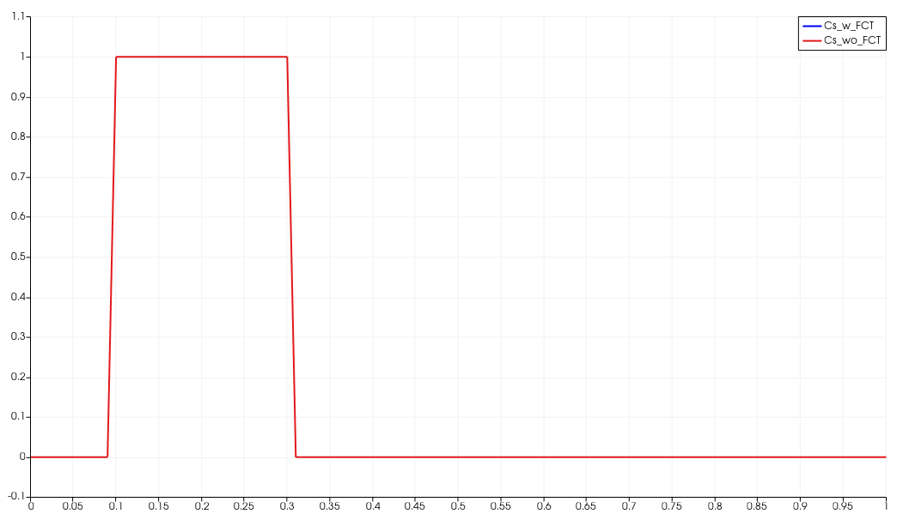
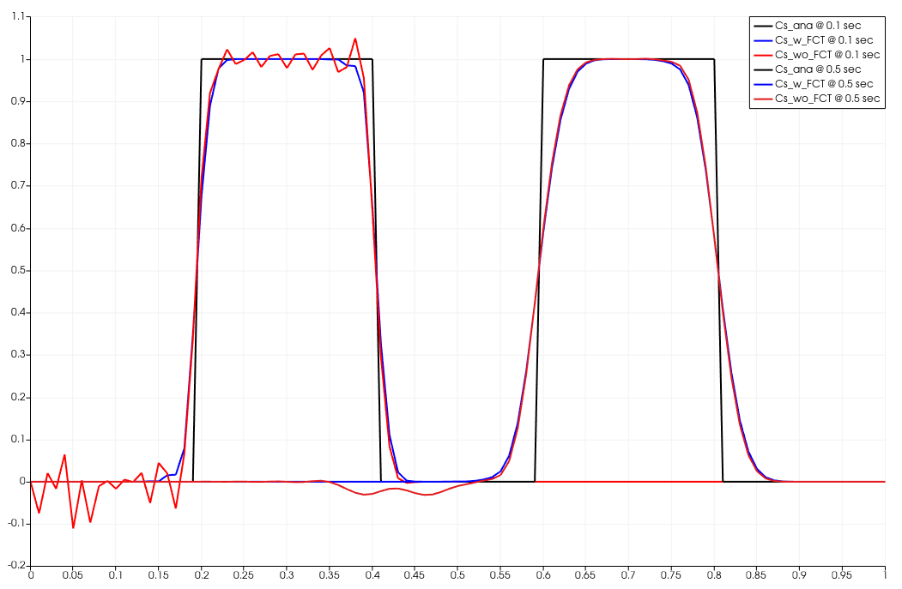

+++
author = "Renchao Lu and Haibing Shao"
weight = 163
project = ["Parabolic/ComponentTransport/FCT_test/1d_step_func.prj"]
date = "2023-11-28T11:30:09+01:00"
title = "Flux Corrected Transport (FCT)"
image = "fct_comp_time_t1.png"
+++



## Motivation

In many ComponentTransport or reactive transport applications, a common issue is the oscillation in the concentration profile, especially when a strong advection is applied versus the diffusion/dispersion.
Such oscillation is undesirable, particularly in the reactive transport process, as the resulting negative concentrations will not be accepted by chemical solvers.

In order to mitigate this problem, the Flux Corrected Transport (FCT) feature is introduced as one of the numerical stabilization schemes.
The feature is implemented following two publications listed in the references.
This benchmark shows how to use the FCT feature and its effect on suppressing the oscillation.

## Using the FCT feature

By default, the FCT feature will NOT be applied.
To activate it, the user needs to define the type of numerical stabilization in the input file as follows.

```xml
    <processes>
        <process>
            <name>hc</name>
            <type>ComponentTransport</type>
            <integration_order>2</integration_order>
            <coupling_scheme>staggered</coupling_scheme>
            <process_variables>
                <concentration>Cs_w_FCT</concentration>
                <pressure>pressure</pressure>
            </process_variables>
            <specific_body_force>0</specific_body_force>
            <numerical_stabilization>
                <type>FluxCorrectedTransport</type>
            </numerical_stabilization>
        </process>
    </processes>
```

Currently, the FCT scheme has been implemented in the ComponentTransport process only.
Another limitation is that the FCT scheme was not implemented to work with the MPI parallelization as of now.

With the above configuration, FCT will take effect after the global mass (M) and conductance (K) matrices have been assembled.
The physical meaning is to modify the M and K matrices, so that only fluxes in the same direction as the concentration gradient are allowed.
This effectively suppresses the oscillation in the concentration profile, and also avoids negative concentration values.
On the other side, when FCT is applied, numerical dispersion will be introduced, as mass lumping in the M matrix has been applied.
Also, several non-linear iterations are expected, which might slow down the simulation.

## Model configuration



The benchmark domain is a 1-m long 1D column, discretized into 100 elements and 101 nodes.
The porosity of the column is set to 1.0.
The flow field is from left to right.
On the right end of the column, the pressure is set to 1e5 Pa.
On the left end, a fixed flux of 1e3 m3/sec is imposed, resulting in a Darcy velocity of 1 m/sec towards the right.
From 0.1 m to 0.3 m, the initial concentration of Cs is set to 1.0, producing a sharp gradient in the concentration profile (see above figure).
The dispersion and diffusion are both set to zero in the model, with the purpose to generate oscillation.
The benchmark runs from 0 to 0.5 seconds, with a fixed time step size of 0.001 seconds.

## Model result



The above figure compares the simulated concentration profiles with or without the FCT stabilization scheme at different times.
It is clearly shown that strong oscillation is present when FCT feature is turned off (red curve).
With the FCT stabilization (blue), the oscillation is suppressed, and all concentration values are non-negative.
It is also found that numerical dispersion, no matter FCT is applied or not, is always present when compared to the analytical profiles (black).

## References

<!-- vale off -->

Kuzmin, D., 2009. Explicit and implicit FEM-FCT algorithms with flux linearization. Journal of Computational Physics, Volume 228(7), 2517-2534. [doi](https://doi.org/10.1016/j.jcp.2008.12.011)

Watanabe, N., and Kolditz, O., 2015. Numerical stability analysis of two-dimensional solute transport along a discrete fracture in a porous rock matrix, Water Resour. Res., 51, 5855–5868, [doi](https://doi.org/10.1002/2015WR017164).
