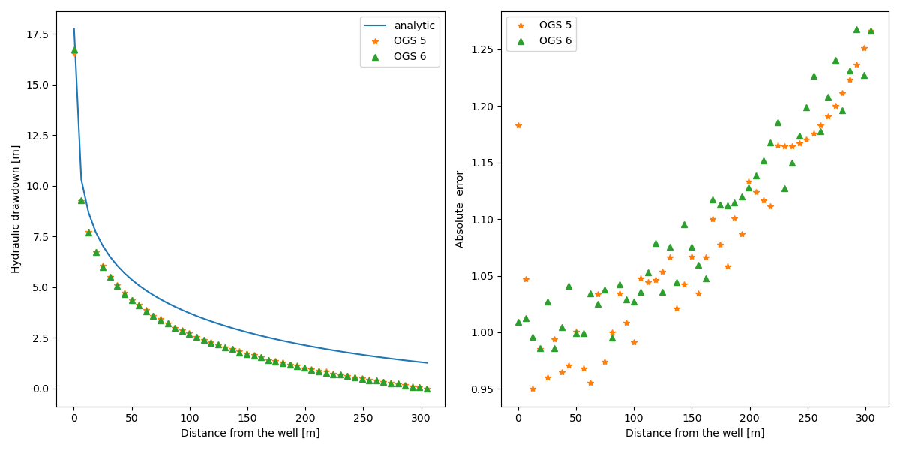

+++
date = "2017-02-17T14:33:45+01:00"
title = "Theis' problem"
weight = 171
project = ["Parabolic/LiquidFlow/AxiSymTheis/axisym_theis.prj"]
author = "Wenqing Wang"
image = "theis.png"
+++



## Problem description

Theis' problem examines the transient lowering of the water table induced by a
 pumping well. Theis' fundamental insight was recognizing that Darcy's law
  is analogous to the law of heat conduction, with hydraulic pressure analogous
   to temperature and the pressure gradient analogous to the thermal gradient.

The assumptions required for the Theis solution are as follows:

- The aquifer is homogeneous, isotropic, confined, and semi-infinite in radial extent.
- The aquifer has uniform thickness.
- The well fully penetrates the entire aquifer thickness.
- The effects of well storage can be neglected.
- The well has a constant pumping rate.
- No other wells exist.

The problem can be expressed as an axisymmetric one, which is described
 mathematically in a radial coordinate system as follows:

$$
S \dfrac{\partial h}{\partial t} = T\dfrac{1}{r}\dfrac{\partial}{\partial r}
   \left( r \dfrac{\partial h}{\partial r}\right),
$$
$$
\begin{align*}
&h(\infty, t) = h_0, \forall\, t\geqslant0,\\
& 2\pi T \lim_{r\rightarrow0}\left(r \dfrac{\partial h}{\partial r}\right)=Q_w,
\end{align*}
$$
where $T$ is the aquifer transmissivity or hydraulic conductivity [$L^{2}T^{-1}$],
 $S$ is the aquifer storage $[-]$,
 $h_0$ is the constant initial hydraulic head $[L]$,
 $Q_w$ is the constant discharge rate [$L^{3}T^{-1}$],
   $t$ is time $[T]$, $r$ $[L]$ is the distance from the well.

## Analytical solution

The analytical solution of the above equation, or the head drawdown, is obtained
 as
$$
\begin{eqnarray}
h_0 - h(t,r) = \frac{Q}{4\pi T}W(u)
\label{theis}
\end{eqnarray}
$$

$$
\begin{eqnarray}
u = \frac{r^{2}S}{4Tt}
\label{theis_u}
\end{eqnarray}
$$
where $W(u)$ is the well function defined by an infinite series for a confined
 aquifer as

<!-- vale off -->
$$
\begin{eqnarray}
W(u) = -\gamma -lnu + \sum^{\infty}_{k=1}{\frac{(-1)^{k+1}u^k}{k\cdot k!}}
\label{theis_wu}
\end{eqnarray}
$$
<!-- vale on -->

where $\gamma\approx$ 0.5772 is the Euler-Mascheroni constant. For practical
 purposes, the simplest approximation of $W(u)$ was proposed as
  $W(u)=-0.5772-lnu$  for $u <$ 0.05. Other more exact approximations of the
  well function were summarized by R. `Srivastava` and A. `Guzman-Guzman` [[1]](#1).

## Numerical settings

The parameters are taken from the paper by `Pinder` and `Frind` [[2]](#2) and
 the book by O. `Koldtiz` et.al [[3]](#3). As in [[3]](#3), the length unit
  is converted from feet to meters.
The well radius $r_0$ is 0.3048 m, the infinite domain is approximated with a
boundary located at a large distance of 304.8 m from the well center.

 The parameters are given in the following table:

| Parameter              | Symbol        |      Value      |    Unit |
| :--------------------- | :------------ | :-------------: | ------: |
| Initial condition      | $h(r,0)$      |       0.0       |       m |
| Pumping rate           | $Q$           |     1223.3      | m$^3$/d |
| Boundary condition     | $h(304.8, t)$ |        0        |       m |
| Hydraulic conductivity | $T$           | 9.2903$10^{-4}$ |     m/s |
| Storage coefficient    | $S$           |    $10^{-3}$    |       - |

Where the pumping rate is uniformly applied to the well surface as a Neumann
 boundary condition with the value calculated as $Q/(2\pi r_0)/86400$
with a unit of m/s.

## Results and evaluation

Firstly, we examine the head variation at a point $r=9.7536$ m, representing the
 observation position. The figure below compares the head variation
  obtained  by using the analytical solution, the result from OGS-5, and
 the result from OGS-6, respectively, within the time interval [10, 10$^5$] s.

The figure demonstrates a good match between the analytical solution and
 the numerical solutions obtained using OGS-5 and OGS-6 within the time interval
 [10, 10$^4$] s, consistent with the results provided in [[2]](#2) and [[3]](#3).
  A similar good match is observed in the following figure, which
 compares the head profiles at t=1728 s:

At the point with the largest head value, the absolute error of the numerical
 solution is approximately 0.34.

 Beyond 10$^4$, an evident discrepancy arises between the
  analytical solution and the numerical solutions.
This discrepancy increases over time due to the inability of the numerical method
 for a bounded domain (like the FEM) to represent an infinite domain accurately.

 The figures below show the comparison of the head profiles  at t=10$^5$ s,
   highlighting this significant discrepancy.

## Conclusions

The analytical solutions are obtained for an ideal problem with an infinite domain.
 However, in the FEM analysis, the infinite domain must be approximated within a
 finite range. Therefore, the numerical method provides accurate
  solutions only for  positions relatively close to the well and within
   a specific time interval. Despite this limitation, real-world application
    are typically constrained by similar conditions, making the numerical
     approach valid and practical for most idealized cases from the in situ
    experiments.

### Reference

<a id="1">[1]</a>
`Srivastava`, R. and `Guzman‐Guzman`, A., 1998. Practical approximations of the well
 function. *Groundwater*, 36(5), pp.844-848.

<a id="2">[2]</a>
`Pinder`, G.F. and `Frind`, E.O., 1972. Application of Galerkin's procedure to
  aquifer analysis. *Water Resources Research*, 8(1), pp.108-120.

<a id="3">[3]</a>
`Kolditz`, O., `Shao`, H., `Wang`, W. and `Bauer`, S., 2016. Thermo-hydro-mechanical
 chemical processes in fractured porous media: modelling and benchmarking
  (Vol. 25). Berlin: Springer.
