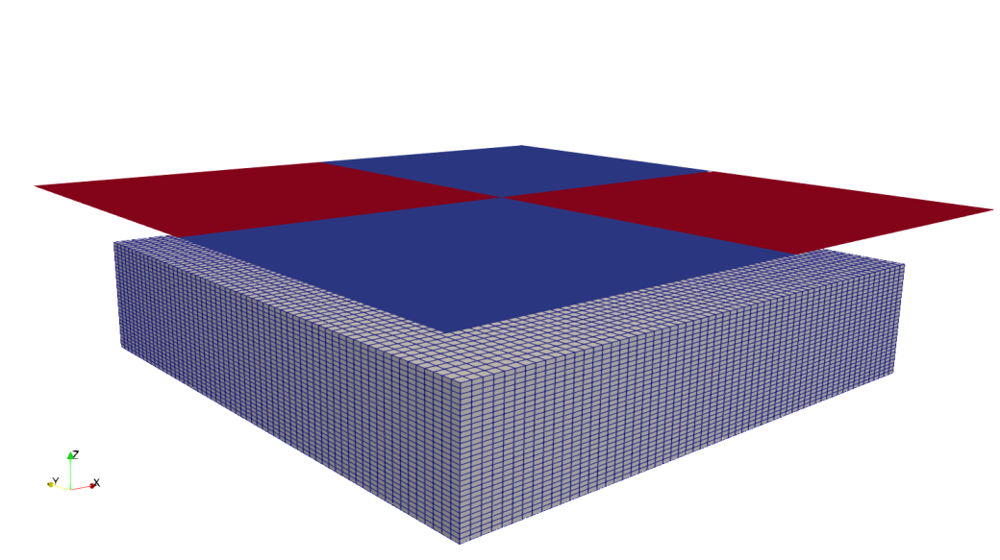
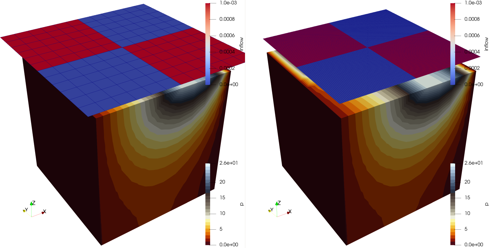

+++
date = "2023-10-26T14:29:45+01:00"
title = "Liquid flow with raster parameter based boundary condition"
weight = 171
project = ["Parabolic/LiquidFlow/RasterParameter/GroundwaterModelWithRasterBC.prj"]
author = "Thomas Fischer"
image = ""
+++



## Motivation

Specifying spatially and temporally heterogeneous parameters for models with
fine mesh resolution and many time steps can lead to very large input files.

For instance, let us assume that the discretization of the study domain contains
n elements and that t time steps should be simulated. Hence, you need $n \times
t$ storage space.

For instance, sometimes the spatial distribution of the boundary values is given
by raster data with a different spatial resolution than the subdomain mesh on
which the boundary values are to be set. In such cases, the raster parameter can
be used both to reduce the memory footprint of the input data enormously and
also to avoid time-consuming preprocessing.

In the figure, the 2x2 raster contains 4 raster cells or 4 (possible different)
values.  In the example illustration, each raster grid cell covers 225 surface
elements. If we were to store this information directly in the surface mesh, we
would need about 225 times more memory.


## Examples

The first simple example should demonstrate the application of a boundary
condition based on the raster parameter. We start with homogeneous parabolic
problem:
$$
\begin{equation}
s\;\frac{\partial p}{\partial t} + k\; \Delta p = q(t,x) \quad \text{in }\Omega
\end{equation}
$$
w.r.t boundary conditions
$$
\eqalign{
p(t, x) = g_D(t, x) &\quad \text{on }\Gamma_D,\cr
k\;{\partial p(x) \over \partial n} = g_N(x) &\quad \text{on }\Gamma_N,
}$$

The domain $\Omega = [0,1]^3$ is a cube. Dirichlet-type boundary conditions are
set on the left ($x=0$) side and the right ($x=1$) side of the cube. On the top
a Neumann-type boundary condition is set by a raster parameter.  Here,
simulations of two almost identical models are conducted. The only difference is
the raster used for setting the boundary condition. The first simulation is done
with a coarse raster as input for the boundary condition, the second one is
executed with a fine raster as input.

## Specification in OGS project file

In the parameter specification section of the project file it is possible to add
a parameter type with the type `Raster`.

### Step 1: Loading raster data

```xml
<rasters>
    <raster>
        <file>RasterFileName.nc</file>
        <variable>VariableInNetCDFFile</variable>
        <dimenension>DimensionOfVariable</dimension> <!-- optional; default 1 -->
    </raster>
</rasters>
```

A snippet from a project file looks is:

```xml
<rasters>
    <raster>
        <file>recharge_GDM_DE1_1951-2019_monthly_dailymean_mm_per_day_EPSG25832.nc</file>
        <variable>recharge</variable>
        <dimenension>1</dimension>
    </raster>
</rasters>
```

### Step 2: Creating parameter from the loaded raster data

The name of the raster parameter shall be constructed as follows:
`RasterFileName_VariableInNetCDFFile_DimensionOfVariable`

```xml
<parameter>
    <name>RasterFileName_VariableInNetCDFFile_DimensionOfVariable</name>
    <type>Raster</type>
</parameter>
```

The corresponding snippet from a project file would be:

```xml
<parameter>
    <name>recharge_GDM_DE1_1951-2019_monthly_dailymean_mm_per_day_EPSG25832_recharge_1</name>
    <type>Raster</type>
</parameter>
```

### Step 3: Using the parameter in boundary condition specification

```xml
<boundary_condition>
    <mesh>Subsurface_Top</mesh>
    <type>Neumann</type>
    <parameter>RasterFileName_VariableInNetCDFFile_DimensionOfVariable</parameter>
</boundary_condition>
```

In an practical example the corresponding XML description of the boundary
condition is then:

```xml
<boundary_condition>
    <mesh>Subsurface_Top</mesh>
    <type>Neumann</type>
    <parameter>recharge_GDM_DE1_1951-2019_monthly_dailymean_mm_per_day_EPSG25832_recharge_1</parameter>
</boundary_condition>
```

## Results


The pressure distribution within the domain is depicted in the following figure
(again left: coarse raster input; right: fine raster input). The distributions
are identical up to machine precision.

