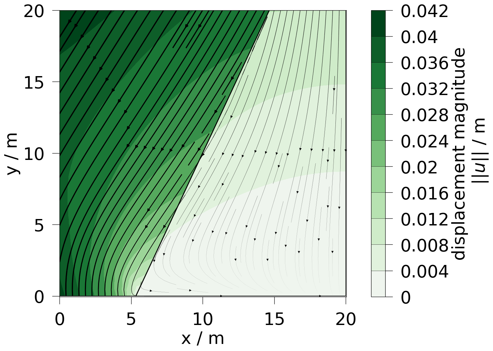
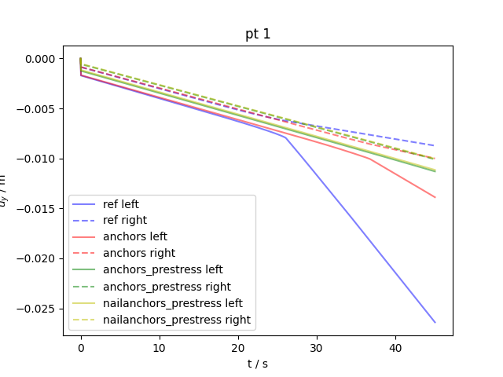

+++
author = "Jörg Buchwald, Mehran Ghasabeh, Thomas Nagel"
weight = 114
project = ["Mechanics/SlopeStabilityAnchors/fault_slip_SD_noniterWP_anchors_prestress.xml"]
date = "2025-07-11T14:39:39+01:00"
title = "Slope stabilized by anchors"
image = "output_10_0.png"
+++



## Problem description

### Slope stabilized by anchors

The problem consists of a rectangular model domain divided by a weakness plan.
While the right part is fixed at the bottom and the right side, the left part is only controlled by Neumann traction forces.
A force pushing at the top on both sides causes a slipping of the slope.
This slip can be prevented by fixing the left part using one-dimesional anchor elements to the fixed side.



Anchor elements can be defined in JSON files by giving the start and end points and setting their properties:

```json
{
    "anchor_start_points": [
        [1, 18, 0],
        [1, 14, 0],
        [1, 9, 0 ],
        [1, 4.5, 0]
    ],
    "anchor_end_points": [
        [16.4, 18.0, 0],
        [14.4, 14.0, 0],
        [12.4, 9.0, 0],
        [10.4, 4.5, 0]
    ],
    "maximum_anchor_stress": [500e26, 500e26, 500e26, 500e26],
    "initial_anchor_stress": [5e7, 5e7, 5e7, 5e7],
    "residual_anchor_stress": [250e6, 250e6, 250e6, 250e6],
    "anchor_radius": [0.2, 0.2, 0.2, 0.2],
    "anchor_stiffness": [100e9, 100e9, 100e9, 100e9]
}
```

This JSON file can be converted into an Anchor VTU file which can be read in as every other boundary or source term mesh file:

```bash
CreateAnchors -f four_anchors.json -i geo_domain_2D_q8.vtu -o four_anchors_prestress.vtu -l all --max-iter 60 --tolerance 1e-13
```

The actual Anchors are the activated by the corresponding source term type:

```xml
<source_terms>
    <source_term>
        <mesh>four_anchors_prestress</mesh>
        <type>EmbeddedAnchor</type>
    </source_term>
</source_terms>
```

The following plot shows the difference in the displacement of the left and the right side without anchors, with relaxed and prestressed anchors.
(Keep in mind that the simulation time in the ctest was shortened for faster executions in the ci-test pipeline.
Details can be found in the reference `prj` file: `fault_slip_SD_noniterWP_reference.prj`)


