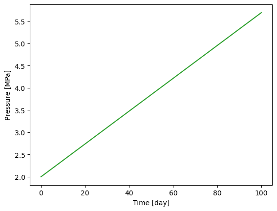
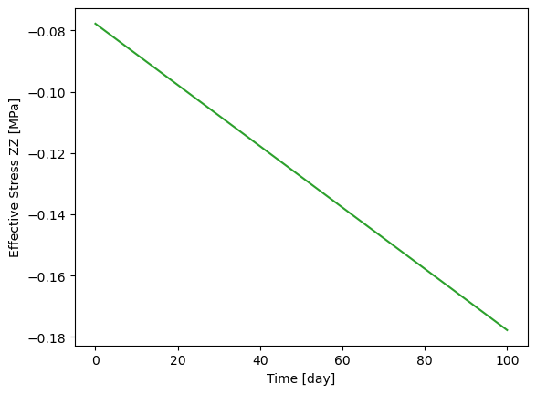

+++
project = ["ThermoHydroMechanics/HeatingHomogeneousDomain/hex_THM.prj"]
author = "Wenqing Wang"
title = "Heating of a homogeneous volume"
date = 2023-02-10T16:12:48+01:00
weight = 100
image = "domain.png"
+++


This example is one of the mini-benchmarks of  FE-Modelling Task Force
(by Andrés Alcolea et. al.). The example is aimed to simulate the coupled THM
 processes in a fully water saturated unit cubic porous medium ($[0, 1]^3\,\text{m}^3$)
 with a linear homogeneous temperature increment from
 20$^{\circ}$C to 30$^{\circ}$C in 100 days.

The gravity is not considered in all balance equations.
 Since the temperature is homogeneous, the specific heat capacity is set to zero
 and thermal conductivity can be any non-zero number. The liquid density is
 given as
 $$\rho_L = \rho_0 \exp (\beta_L (p_L-p_0)+\alpha_L^T(T-T_{ref})) $$
 with

- $\rho_0=1002.6$ kg/m$^3$ the initial liquid density,
- $\beta_L=4.5\cdot10^{-10}$ Pa the liquid compressibility,
- $\alpha_L^T=-2.0\cdot 10^{-4} \text{ K}^{-1}$ the liquid thermal expansivity,
- $T_{ref} = 273.15 \text{ K}$ the reference temperature.

 While the liquid viscosity is defined as
  $$\mu_L = \text{A}\exp(\text{B}/T)$$
with  A=$2.1\cdot 10^{-6} \text{ Pa}\cdot\text{s}$, and B=1808.5 K.

 The other material parameters are given below:

| Property               | Value | Unit        |
|------------------------|-------|-------------|
| Young's modulus        | 1     | GPa         |
| Poisson ratio          | 0.35  | -           |
| Solid thermal expansion | $3 \cdot 10^{-6}$  |$\text{K}^{-1}$     |
| Biot's coefficient   | 0.96111  | -     |
| Porosity   | 0.1  | -     |
| Intrinsic permeability |$3.0 \cdot 10^{-20}$ | m$^2$|

Initially, the temperature is  $20 ^{\circ}$C, the pore pressure is
 $2\cdot 10^6$ Pa, and all effective stress components are zero.

At the boundary surfaces, there is no heat or flow flux, and the normal
 displacement is fixed to zero.

As a CTest, only 5 time steps with a fixed time step size $1.728\cdot 10^4$ s
 are computed. If the example is run up to 50 time steps, corresponding to 100
 days of simulation time, the variations of pressure and effective
 stress can be obtained as that are shown in the two figures below:

<figure>

</figure>
