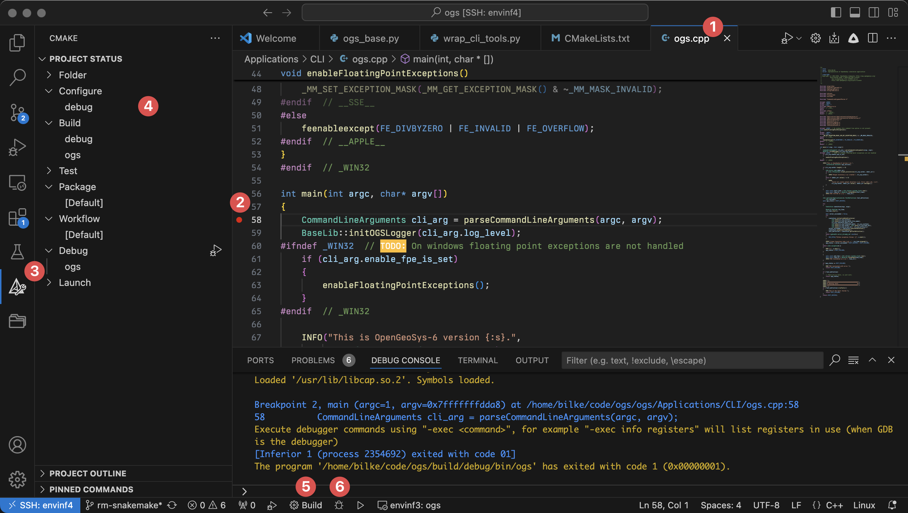
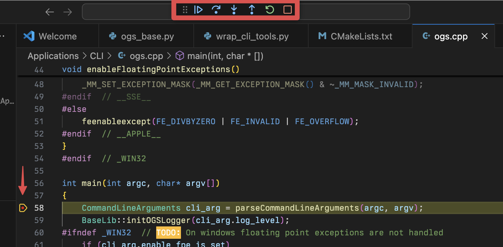
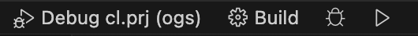

+++
date = "2014-09-12T11:00:13+01:00"
title = "Debugging in VS Code"
author = "Lars Bilke"
weight = 1062

[menu]
  [menu.devguide]
    parent = "advanced"
+++

<div class="note">
<i class="far fa-exclamation-triangle"></i> This guide applies to Linux-only!
</div>

[Visual Studio Code](https://code.visualstudio.com/) is a powerful text editor which can be expanded to a full featured integrated development environment (IDE) with plugins. To debug a program make sure to install the [C/C++ Extension Pack](https://marketplace.visualstudio.com/items?itemName=ms-vscode.cpptools-extension-pack) which includes support for CMake and debugging with `gdb`.

Then in the editor:

1. Open e.g. `ogs.cpp`.
2. Set a [breakpoint](https://code.visualstudio.com/docs/editor/debugging#_breakpoints) in the first line of the `main()`-function (around line 58) by clicking on the left gutter in the editor window (a red dot marks the enabled breakpoint).
3. Click on the `CMake`-sidebar.
4. Make sure that `debug` is the active configure and build preset.
5. Click the `Build`-button in the status bar.
6. Click the bug icon in the status bar.



After some seconds the debugger starts and halts at the specified breakpoint indicated y the yellow marker around the breakpoint and line. You can now step into or over statements with debugger controls at the top of the window:



To debug with specific arguments to `ogs`, e.g. for setting a `.prj`-file:

1. Click on the `Debug`-sidebar.
2. Click on `create a launch.json file`.
3. Click `Add Configuration`.
4. Select `C/C++: (gdb) Launch`


Edit the file e.g. like this:

```json
"program": "${workspaceFolder}/../build/debug/bin/ogs",
"args": ["${workspaceFolder}/Tests/Data/Parabolic/ComponentTransport/ReactiveTransport/CO2Injection/cl.prj"],
"cwd": "${workspaceFolder}/../build/debug/_out",
```

This sets the program to debug to the `ogs`-binary in the debug build folder, sets a specific `.prj`-file to run and sets the working directory (output folder) to some `_out`-subfolder in the build directory.

You can also give the debug configuration some meaningful name, e.g. `"name": "Debug cl.prj",` which results in a new button in the status bar:



Click on it to start the debug session.
