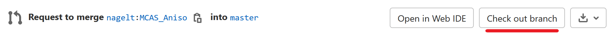

+++
date = "2018-02-26T11:00:13+01:00"
title = "Code Reviews"
author = "Lars Bilke"
weight = 1015

[menu]
  [menu.devguide]
    parent = "development-workflows"
+++

Once you have submitted a [merge request]() the code review process kicks in which can be summarized as:

- A core developer picks your MR for review.
- The core developer checks your code in respect to e.g. style and correctness.
- The core developer may also give hints on how to improve the code regarding to e.g. readability or performance.
- You iterate (make modifications) on the code.
- The core developer again checks the code and finally approves the changes.
- If also the [CI]() is happy (all checks and tests did pass) the MR is merged.

For more information on merge requests see the [GitLab documentation](https://docs.gitlab.com/ee/user/project/merge_requests/getting_started.html).

### How to request a code review

To request a code review set the merge request label to `workflow::please review`!

If you do not want a reviewer to have a look, e.g. because you are currently working on the MR you can set the merge request label to `workflow::in development` or `workflow::paused` (disables CI).

### How to indicate that the MR is ready for merge

- Set the merge request label to `workflow::please review`
- Remove the [`Draft`-flag](https://docs.gitlab.com/ee/user/project/merge_requests/drafts.html#mark-merge-requests-as-ready) (if you have set it previously)

### How to checkout a MR from another developer locally

On the merge request page in the first box which contains information on the MR author and branch name there is button labelled `Check out branch` which will show you instructions on how to locally checkout this MR:

