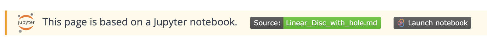

+++
date = "2022-06-28T15:28:13+01:00"
title = "Jupyter notebooks as documentation and tests"
author = "Lars Bilke"
weight = 1025

[menu.devguide]
parent = "development-workflows"
+++

## The big picture

[Jupyter notebooks](https://jupyter.org) are interactive computing environments where prose and code can be combined. In the OGS project notebooks can be used to define complex benchmark workflows and its results can be converted to be shown on the OGS web page (see an [example here](/docs/benchmarks/small-deformations/linear_disc_with_hole/)). Notebooks can be used in two ways:

1. To [directly generate a web page](#1-direct-conversion) (direct conversion from notebook to web page).
2. To be [executed during CI](#2-executed-notebooks) whose results are converted to a web page.

## 1. Direct conversion

Consider direct conversion for the following use cases:

- Execution of the notebook is very time-consuming (too long for regular CI tests).
- The notebook uses Python packages which are not part of the testing environment (see `Tests/Data/requirements*.txt` for available packages).
- The notebooks needs other custom tools or environment.
- The shown functionality is not required to be regularly tested.

### Create a new notebook

Create a new notebook file in `web/contents/docs/[some-section]/my-page/my-page.ipynb`. It is important that the notebook filename is the same as the containing folder name!

If you use additional images put them into the `my-page`-folder.

### Add web meta information

If the notebook result should appear as a page on the web documentation a frontmatter with some meta information (similar to [regular web pages]()) is required as the first cell in the notebook:

- Add a new cell and move it to the first position in the notebook
- Cell type needs to be `markdown` or `raw`
- Add meta information e.g.:

  ```md
  +++
  title = "BHE Meshing"
  date = "2023-08-18"
  author = "Joy Brato Shil, Haibing Shao"
  +++
  ```

---

Make sure that you execute the cells in the notebook and save the notebook (with generated outputs).

### Preview locally

To get a preview of the web page run the `convert_notebooks`-script:

```bash
# You need the converter-tool nbconvert installed. Recommended way is to
# create and activate a virtual environment and install it there:
python -m venv .venv  # or `python3 -m ...` on some systems
source .venv/bin/activate # .\.venv\Scripts\Activate.ps1 on Windows
pip install nbconvert

python web/scripts/convert_notebooks.py

cd web
hugo server
# open http://localhost:1313
```

The notebook needs some meta information (only `title`, `date` and `author` is required) as [outlined below](#add-web-meta-information).

Also make sure that you also provide necessary data files and please don't use machine specific paths (e.g. assume that `ogs` and other tools are in the `PATH`).

## 2. Executed notebooks

These notebooks are part of the regular CI testing. Please try to keep the notebook execution time low.

### Create a new notebook

Create a new notebook file in `Tests/Data` (if it should appear in the benchmark gallery) or in `web/content/docs` (e.g. for tutorials). Create it as a regular Markdown-file with Python code blocks. The notebook execution and conversion is done via [Jupytext](https://jupytext.readthedocs.io/en/latest). See examples:

- [Linear_Disc_with_hole.md](https://gitlab.opengeosys.org/ogs/ogs/-/blob/master/Tests/Data/Mechanics/Linear/DiscWithHole/Linear_Disc_with_hole.md) (Jupytext-based benchmark notebook in Markdown)
- [notebook-bhe_meshing.md](https://gitlab.opengeosys.org/ogs/ogs/-/blob/master/web/content/docs/tutorials/bhe_meshing/notebook-bhe_meshing.md) (Jupytext-based tutorial notebook in Markdown)
- [SimpleMechanics.ipynb](https://gitlab.opengeosys.org/ogs/ogs/-/blob/master/Tests/Data/Mechanics/Linear/SimpleMechanics.ipynb) (regular `.ipynb`-notebook are also possible but Markdown-based notebooks are preferred)

### Add web meta information

If the notebook result should appear as a page on the web documentation a frontmatter with some meta information (similar to [regular web pages]()) is required as the first cell in the notebook:

```markdown
+++
title = "SimplePETSc"
date = "2021-11-09"
author = "Lars Bilke"
image = "optional_gallery_image.png"
web_subsection = "small-deformations" # required for notebooks in Tests/Data only
+++
  <-- Add Two newlines here to separate -->
  <-- the frontmatter as its own cell   -->
```

- Frontmatter needs to be in [TOML](https://toml.io)-format.
- For notebooks describing benchmarks `web_subsection` needs to be set to a sub-folder in [web/content/docs/benchmarks](https://gitlab.opengeosys.org/ogs/ogs/-/tree/master/web/content/docs/benchmarks) (if not set the notebook page will not be linked from navigation bar / benchmark gallery on the web page).
- If you edit a Markdown-based notebook with Jupyter and the Jupytext extension please don't add the two newlines but make sure that the frontmatter has its own cell (not mixed with markdown content).
- For (deprecated) `.ipynb`-based notebooks the frontmatter needs to be given in the first cell. See existing notebooks (e.g. [SimpleMechanics.ipynb](https://gitlab.opengeosys.org/ogs/ogs/-/blob/master/Tests/Data/Mechanics/Linear/SimpleMechanics.ipynb)) for reference.

### Notebook setup

The first cell after the frontmatter needs to be a `markdown`-cell!

#### Markdown cells

- HTML inside Markdown cells may be used for specific reasons (e.g. better image formatting).
- For notebooks in `Tests/Data` only: Static images e.g. for the gallery image or to be used in Markdown cells have to be located in either `images`- or `figures`-subdirectories beneath the Notebook file! Otherwise they will not show up on the web site.
  - For image captions add a title in quotation marks after the image path, e.g.

    ```md
    
    ```

  - Please note that in merge request web previews static images are not shown at all.

#### Python cells

- Do not use machine-specific or absolute paths! See the following example to set up notebook output paths:

  ```python
  import os
  from pathlib import Path

  # On CI out_dir is set to the notebooks directory inside the build directory
  # similar to regular benchmark tests. On local testing it will output to the
  # notebooks source directory under a _out-subdirectory.
  out_dir = Path(os.environ.get("OGS_TESTRUNNER_OUT_DIR", "_out"))
  if not out_dir.exists():
      out_dir.mkdir(parents=True)

  # ...
  # Run ogs; get input data from current directory; write to `out_dir`
  ! ogs my_project.prj -o {out_dir} > {out_dir}/log.txt

  # OR with ogstools:
  # ... setup model ...
  import ogstools as ogs
  model = ogs.Project(input_file="input.prj", output_file="output.prj")
  model.run_model(logfile=os.path.join(out_dir, "log.txt"), args=f"-o {out_dir}")

  # Verify results; on failure assert with:
  assert False
  # or
  raise SystemExit()
  ```

- Do not write anything into the source directories. Use an `out_dir` as above.
- Assume that `ogs` and other tools are in the `PATH`.

### Execution environment

In CI the notebooks are executed with all dependencies installed into a virtual environment in the build directory. The installed packages are defined in `Test/Data/requirements.txt`. The same setup can be enabled locally by setting the CMake option `OGS_USE_PIP=ON`. E.g.

```bash
cmake --preset release -DOGS_USE_PIP=ON    # Creates the virtual environment
source ../build/release/.venv/bin/activate # Activates the virtual environment
jupyter lab                                # Starts Jupyter Lab
```

### Register with CTest

Add the notebook to CTest ([example](https://gitlab.opengeosys.org/ogs/ogs/-/blob/master/ProcessLib/SmallDeformation/Tests.cmake#L272-281)) with e.g.:

```cmake
if(NOT OGS_USE_PETSC)
    NotebookTest(NOTEBOOKFILE Mechanics/Linear/SimpleMechanics.ipynb RUNTIME 10)

    # Notebooks in web/content need to be prefixed with 'notebook-'!
    NotebookTest(NOTEBOOKFILE ../../web/content/docs/tutorials/bhe_meshing/notebook-bhe_meshing.md
                 PYTHON_PACKAGES openpyxl
                 RUNTIME 10)
endif()
```

- `NOTEBOOKFILE` is relative to `Tests/Data`.
- If your notebook requires additional dependencies add them with `PYTHON_PACKAGES`.
- If the notebook is in `web/content` it is important to prefix the notebook file name with `notebook-`! The prefix is required to indicate Hugo that this is a notebook and not a regular markdown page.

<div class='note'>

If your notebook should **not** appear on the website add the `SKIP_WEB`-option to `NotebookTest()`. This may be useful if the notebook serves as CI test only, e.g. comparing multiple simulation runs or doing performance measurements. But please also note that there will be no artifact produced (except for notebook errors which get reported as usual).

</div>

Then e.g. run all notebook test (`-R nb`) in parallel (`-j 4`) with:

```bash
# cd into build directory
source .venv/bin/activate # Is created with OGS_USE_PIP=ON, see above note on environment.
ctest -R nb -j 4 --output-on-failure
```

### Advanced topics

#### Jupytext usage

If you use the [execution environment](#execution-environment) [Jupytext](https://jupytext.readthedocs.io/en/latest) is already configured and its usage is transparent:

- Double-click on a markdown file will open it as a Notebook
- Upon saving or executing a linked `.ipynb`-file is created in the background which stores outputs
- You still edit the Markdown file but don't notice the difference to regular notebooks in the Lab UI

#### Run a notebook in BinderHub

On the web site or MR web previews on pages generated by a notebook there is a new banner:



- Click the button to launch the notebook in BinderHub.
- The environment running in BinderHub is defined in [`bilke/binder-ogs-requirements` at GitHub](https://github.com/bilke/binder-ogs-requirements)
- When clicking the link it launches a Jupyter Lab instance pre-configured with ogs [via wheel](https://gitlab.opengeosys.org/ogs/ogs/-/blob/master/Tests/Data/requirements-ogs.txt#L2), clones the current ogs repo in it and opens the respective notebook ready to run. Please note that startup times may be several minutes (if the execution environment is not already built and cached) and the computing resources are limited. Currently only the serial ogs configuration is available.

#### PyVista notebooks on headless Linux systems

PyVista (or VTK) requires a windowing environment for rendering. You can provide a virtual window with `xvfb-run`:

```bash
sudo apt install libgl1-mesa-glx xvbf # install xvfb

xvfb-run -a ctest [...] # provide a virtual window to the ctest-run
```
