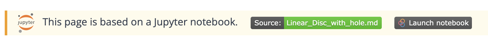

+++
date = "2022-06-28T15:28:13+01:00"
title = "Jupyter notebooks as documentation and tests"
author = "Lars Bilke"
weight = 1025

[menu.devguide]
parent = "development-workflows"
+++

## Introduction

[Jupyter notebooks](https://jupyter.org) are interactive computing environments where prose and code can be combined. In the OGS project notebooks can be used to define complex benchmark workflows and its results can be converted to be shown on the OGS web page (see an [example here](/docs/benchmarks/small-deformations/linear_disc_with_hole/)).

## Executed notebooks

These notebooks are part of the regular CI testing. Please try to keep the notebook execution time low.

### Create a new notebook

Create a new notebook file in `Tests/Data` (if it should appear in the benchmark gallery) or in `web/content/docs` (e.g. for tutorials). Create it as a regular Python-file with Python code blocks and Markdown blocks for text. The notebook execution and conversion is done via [Jupytext](https://jupytext.readthedocs.io/en/latest). See examples:

- [SimpleMechanics.py]({}) (notebooks written as regular `.py` files are preferred but Markdown-based or `.ipynb` files notebooks are also possible)
- [Linear_Disc_with_hole.md]({}) (Jupytext-based benchmark notebook in Markdown)
- [notebook-bhe_meshing.md](https://gitlab.opengeosys.org/ogs/ogs/-/blob/master/web/content/docs/tutorials/bhe_meshing/notebook-bhe_meshing.md) (Jupytext-based tutorial notebook in Markdown)

### Add web meta information

If the notebook result should appear as a page on the web documentation a frontmatter with some meta information (similar to [regular web pages]()) is required as the first cell in the notebook:

```markdown
+++
title = "SimplePETSc"
date = "2021-11-09"
author = "Lars Bilke"
image = "optional_gallery_image.png"
web_subsection = "small-deformations" # required for notebooks in Tests/Data only
+++
  <-- Add Two newlines here to separate -->
  <-- the frontmatter as its own cell   -->
```

- Frontmatter needs to be in [TOML](https://toml.io)-format.
- For notebooks describing benchmarks `web_subsection` needs to be set to a sub-folder in [web/content/docs/benchmarks](https://gitlab.opengeosys.org/ogs/ogs/-/tree/master/web/content/docs/benchmarks) (if not set the notebook page will not be linked from navigation bar / benchmark gallery on the web page).

### Notebook setup

#### Markdown cells

- HTML inside Markdown cells may be used for specific reasons (e.g. better image formatting).
- For notebooks in `Tests/Data` only: Static images e.g. for the gallery image or to be used in Markdown cells have to be located in either `images`- or `figures`-subdirectories beneath the Notebook file! Otherwise they will not show up on the web site.
  - For image captions add a title in quotation marks after the image path, e.g.

    ```md
    
    ```

  - Please note that in merge request web previews static images are not shown at all.

#### Python cells

- Do not use machine-specific or absolute paths! See the following example to set up notebook output paths:

  ```python
  import os
  from pathlib import Path

  # On CI out_dir is set to the notebooks directory inside the build directory
  # similar to regular benchmark tests. On local testing it will output to the
  # notebooks source directory under a _out-subdirectory.
  out_dir = Path(os.environ.get("OGS_TESTRUNNER_OUT_DIR", "_out"))
  out_dir.mkdir(parents=True, exist_ok=True)

  # ...
  # Run ogs; get input data from current directory; write to `out_dir`
  !bash ogs my_project.prj -o {out_dir} > {out_dir}/log.txt

  # OR with ogstools:
  # ... setup model ...
  import ogstools as ot
  model = ogs.Project(input_file="input.prj", output_file=out_dir / "output.prj")
  model.write_input()
  model.run_model(logfile=out_dir / "log.txt", args=f"-o {out_dir} -m .")

  # Verify results; on failure assert with:
  assert False
  # or
  raise SystemExit()
  ```

- Do not write anything into the source directories. Use an `out_dir` as above.
- Assume that `ogs` and other tools are in the `PATH`.
- Don't rely on Jupyter [magic commands](https://ipython.readthedocs.io/en/stable/interactive/magics.html) as the notebooks get executed as regular python scripts as well.

### Execution environment

In CI the notebooks are executed with all dependencies installed into a virtual environment in the build directory. The installed packages are defined in `Test/Data/pyproject.toml` and are installed with [`uv`](https://github.com/astral-sh/uv). The same setup can be enabled locally by setting the CMake option `OGS_USE_PIP=ON`. E.g.

```bash
cmake --preset release -DOGS_USE_PIP=ON    # Creates the virtual environment
source ../build/release/.venv/bin/activate # Activates the virtual environment
jupyter lab [path-to-source-directory]     # Starts Jupyter Lab
```

Instead of activating the environment and manually running `jupyter lab` you can also just build the `jupyter` target:

```bash
cmake --preset release -t jupyter
# or in the build directory:
ninja jupyter
```

### Register with CTest

Add the notebook to CTest ([example](https://gitlab.opengeosys.org/ogs/ogs/-/blob/master/ProcessLib/SmallDeformation/Tests.cmake#L272-281)) with e.g.:

```cmake
if(NOT OGS_USE_PETSC)
    NotebookTest(NOTEBOOKFILE Mechanics/Linear/SimpleMechanics.py RUNTIME 10)

    # Notebooks in web/content need to be prefixed with 'notebook-'!
    NotebookTest(NOTEBOOKFILE ../../web/content/docs/tutorials/bhe_meshing/notebook-bhe_meshing.md
                 PYTHON_PACKAGES openpyxl
                 RUNTIME 10)
endif()
```

- `NOTEBOOKFILE` is relative to `Tests/Data`.
- If your notebook requires additional dependencies add them with `PYTHON_PACKAGES`.
- If the notebook is in `web/content` it is important to prefix the notebook file name with `notebook-`! The prefix is required to indicate Hugo that this is a notebook and not a regular markdown page.
- `RUNTIME` larger than 600 s is executed as large benchmark job.

<div class='note'>

If your notebook should **not** appear on the website add the `SKIP_WEB`-option to `NotebookTest()`. This may be useful if the notebook serves as CI test only, e.g. comparing multiple simulation runs or doing performance measurements. But please also note that there will be no artifact produced (except for notebook errors which get reported as usual).

</div>

Then e.g. run all notebook test (`-R nb`) in parallel (`-j 4`) with:

```bash
# cd into build directory
ctest -R nb -j 4 --output-on-failure
```

To view the notebook as a web preview run:

```bash
ninja preview-web
# Open http://localhost:1313 in your browser
```

### Advanced topics

#### Useful tools

Make sure to have [uv](https://github.com/astral-sh/uv) installed.

Convert .ipynb to .py with [`jupytext`](https://jupytext.readthedocs.io/en/latest/):

```bash
uvx jupytext --to py NOTEBOOKFILE.ipynb
```

Automatically fix code style issues with [`ruff`](https://docs.astral.sh/ruff/):

```bash
uvx ruff check --fix [--unsafe-fixes] NOTEBOOKFILE.py
```

Format the notebook with [`black`](https://black.readthedocs.io/en/stable/):

```bash
uvx black NOTEBOOKFILE.py
```

#### Run a notebook in BinderHub

On the web site or MR web previews on pages generated by a notebook there is a new banner:



- Click the button to launch the notebook in BinderHub.
- The environment running in BinderHub is defined in [`bilke/binder-ogs-requirements` at GitHub](https://github.com/bilke/binder-ogs-requirements)
- When clicking the link it launches a Jupyter Lab instance pre-configured with ogs [via wheel]({}) and the computing resources are limited. Currently only the serial ogs configuration is available.
