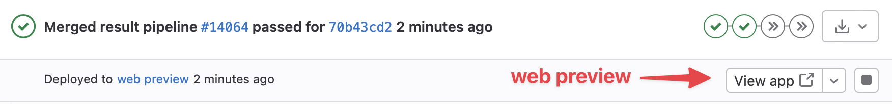

+++
date = "2018-02-23T15:28:13+01:00"
title = "Writing web documentation"
author = "Lars Bilke"
weight = 1024

[menu.devguide]
parent = "development-workflows"

aliases = ["/docs/devguide/documentation/introduction/"]

+++

## The big picture

- Development related content such as developer guide, benchmark documentation, tools description, ... are simple Markdown files in e.g. [/web/content/docs](https://www.opengeosys.org/docs/benchmarks/elliptic/elliptic-neumann)
- You can preview documentation locally with [Hugo](https://gohugo.io) – a static site generator (minimum version: )
- A preview is also generated during [Continuous Integration]( ):
  

Benchmark documentation can also be given in form of Jupyter Notebooks, see [Jupyter notebooks as documentation]() for details.

## Requirements

- Download [Hugo](https://github.com/gohugoio/hugo/releases/latest) and put it in your `PATH`. **Attention:** Use the *extended* version: e.g. `hugo_extended__Windows-64bit.zip`
- Install [Yarn](https://yarnpkg.com/en/docs/install); for downloading required JavaScript & CSS development packages
- Install [npm](https://www.npmjs.com) for CSS / JavaScript compilation with [npx](https://www.npmjs.com/package/npx)

## Getting started

- Inside the source-directory `ogs/web`:
  - Run `yarn` **and** `yarn build` once (this will install required CSS and JavaScript packages)
  - Optionally run `yarn index` (for creating the search index) once
  - Run `hugo server`
  - Open [http://localhost:1313](http://localhost:1313)

As you make modifications to the site it will be rebuild and the page in the browser gets reloaded.

## How-Tos

### Create a new page

By using `hugo new` you can create a new page with the correct frontmatter for that kind of page:

```bash
hugo new --kind benchmark docs/benchmarks/elliptic/groundwater-flow-dirichlet/index.md
```

- path is relative to `content/` and determines the URL of the page

Or you can simply create a new `index.md`-file in the correct location and fill it by yourself. Prefer to use [page bundles](https://gohugo.io/content-management/page-bundles/) when you want to add other assets, e.g. images, to the page.

<div class="note">

#### Page bundle example structure

```bash
content/
├── docs
│   ├── my-post
│   │   ├── image1.jpg
│   │   ├── image2.png
│   │   └── index.md
```

This page will be available at the URL `/docs/my-post/` and the content of the page is in `index.md`.

</div>

### Page meta data

Page meta data is given in frontmatter.

- `weight`: Navigation is handled automatically by the folder structure. Use the `weight`-parameter in the frontmatter to specify the order of pages in ascending order (top `->` down).
- `image`: Specify an image in the page bundle used for the gallery view.

### Write a page

We use [Markdown](https://commonmark.org/help/) for the actual content. Hugo uses the [GoldMark Markdown parser](https://commonmark.org/help/) with the following additional markdown extensions:

- [Definition lists](https://michelf.ca/projects/php-markdown/extra/#def-list)
- [Footnotes](https://michelf.ca/projects/php-markdown/extra/#footnotes)
- [Autolinks](https://github.github.com/gfm/#autolinks-extension-)
- [Strikethrough](https://github.github.com/gfm/#strikethrough-extension-)
- [Table](https://github.github.com/gfm/#tables-extension-)
- [TaskList](https://github.github.com/gfm/#task-list-items-extension-)
- [Typographer](https://daringfireball.net/projects/smartypants/)

#### Images

Use regular Markdown syntax:

```markdown

```

The path to the image is the relative path to the current [page bundle](https://gohugo.io/content-management/page-bundles/).

You can add size attributes to the filename with a `#`-character:

```markdown

```

Possible size values are `one-third`, `one-half` and `two-third`.

For even more flexible image handling you can use Hugo's [`figure`](https://gohugo.io/content-management/shortcodes/#figure)-shortcode, e.g.:

```markdown

```

Or for two images side-by-side:

```markdown


```

#### Equations

Equations can be set with typical LaTeX syntax by using [MathJax](https://www.mathjax.org/). Blocks are defined by `$$` at the beginning and `$$` at the end of the block or by simply using a LaTex environment like `\begin{equation}...\end{equation}`. Inline math uses one `$` as the delimiter. For more usage instructions see the [MathJax LaTeX help](https://docs.mathjax.org/en/latest/input/tex/index.html).

#### Files and Downloads

Files belonging directly to a page (e.g. images shown on that same page) should be added directly. Other stuff such as linked PDF files, book chapter input files should be uploaded elsewhere and linked to. You can ask @bilke to host these files for you (on Azure cloud storage).

#### Bibliography references

Bibliography items from *Documentation/bibliography/*.bib can be referenced by their id (always use lowercase ids) with the `bib`-shortcode:

```bash

```

The bib-file has to be converted into a yaml-file with the [pybtex-convert](https://docs.pybtex.org/cmdline.html)-tool:

```sh
uvx --from pybtex pybtex-convert Documentation/bibliography/ogs.bib web/data/bib_ogs.yaml
uvx --from pybtex pybtex-convert Documentation/bibliography/other.bib web/data/bib_other.yaml
```

This yaml-file is then used by the shortcode.

### Used components

- [Hugo](https://gohugo.io) - Web site generator
- [Tailwind](https://tailwindcss.com) - CSS framework
- [FontAwesome](https://fontawesome.com) - Icons, see [icon search](https://fontawesome.com/icons?d=gallery)
- [Slick Carousel](http://kenwheeler.github.io/slick/) & [FancyBox](https://fancyapps.com/fancybox/3/) for image galleries
