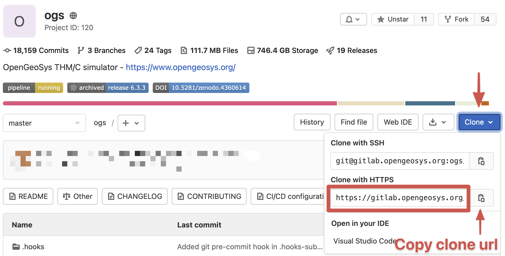

+++
date = "2018-02-23T15:28:13+01:00"
title = "Get the source code"
author = "Lars Bilke"
weight = 3

[menu]
  [menu.devguide]
    parent = "getting-started"
+++

<div class='note'>

<i class="far fa-exclamation-triangle"></i> This page describes how to get the source code as a simple download or git clone. The information on the forking workflow with `git` has been moved to the [Development workflows]()-section.

</div>

## Clone the source code repository with Git

First you need to get the clone URL:



Then clone the repository with `git`:

```bash
git clone --filter=blob:limit=100k https://gitlab.opengeosys.org/ogs/ogs.git
```

<div class='note'>

The `--filter=blob:limit=100k`-parameter instructs git to only fetch files which are smaller than 100 Kilobyte. Larger files (e.g. benchmark files, images, PDFs) are fetched on-demand only. This happens automatically and [is a replacement for the previous Git LFS tracked files](https://gitlab.opengeosys.org/ogs/ogs/-/issues/2961). Requires at least **git 2.22**!

</div>

## Enable git commit hooks with pre-commit

[Git hooks](https://git-scm.com/book/en/v2/Customizing-Git-Git-Hooks) help to check for several issues before doing commits or pushes and it is highly recommended to enable these checks.

Install [pre-commit](https://pre-commit.com/) (a git hook manager):

<div class='win'>

```bash
pip3 install --user pre-commit
```

This installed `pre-commit` to e.g. (depending on your Python version) `C:\Users\[username]\AppData\Roaming\Python\Python313\Scripts`. Make sure to have this directory in your `PATH`!

</div>

<div class='linux'>

```bash
sudo apt install pre-commit
```

</div>

<div class='mac'>

```bash
brew install pre-commit
```

</div>

Enable the hooks in the source code with:

```bash
cd ogs
pre-commit install
```

On first commit the pre-commit environment is setup which may take some time:

```bash
$ git commit
[INFO] Initializing environment for https://github.com/pre-commit/pre-commit-hooks.
[INFO] Initializing environment for https://github.com/psf/black.
[INFO] Initializing environment for https://github.com/nbQA-dev/nbQA.
...
```

You may also want to install `clang-format` (optional):

<div class='win'>

Install clang (which contains `clang-format`) with the [official installer](https://prereleases.llvm.org/win-snapshots/LLVM-12.0.0-6923b0a7-win64.exe).

</div>

<div class='linux'>

```bash
sudo apt install clang-format
```

</div>

<div class='mac'>

```bash
brew install clang-format
```

</div>

## Setup your repository fork

This step is optional for the moment but required once you want to contribute back to OpenGeoSys. To setup your repository fork on GitLab and your local git repository follow-along on [Set Up your fork]().
