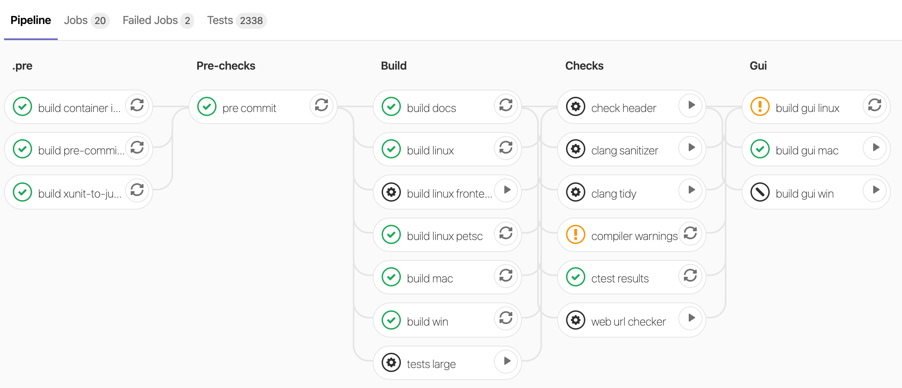

+++
date = "2018-02-26T11:00:13+01:00"
title = "GitLab CI"
author = "Lars Bilke"
weight = 1022

[menu]
  [menu.devguide]
    parent = "testing"
+++

## Introduction

[GitLab CI](https://docs.gitlab.com/ee/ci/) is a powerful [Continuous Integration](../../development-workflows/continuous-integration/) system integrated into GitLab.

The tasks of the CI system are configured in [scripts inside the OGS source code](https://gitlab.opengeosys.org/ogs/ogs/-/tree/master/scripts/ci). The entry point is defined in [`.gitlab-ci.yml`](https://gitlab.opengeosys.org/ogs/ogs/-/blob/master/.gitlab-ci.yml). Scripting and versioning the configuration together with the source code is very powerful, e.g. if you introduce a new OGS CMake configuration in a merge request even the change of the CI jobs configuration or jobs environment (Docker container definition) can be part of the merge request.

## GitLab Pipeline

A CI run consists of a [pipeline](https://docs.gitlab.com/ee/ci/pipelines/) which contains [stages](https://docs.gitlab.com/ee/ci/yaml/#stages) which in turn contain jobs. A job runs a set of instructions (e.g. checking out the source code, building the code, testing the code) on a [runner](https://docs.gitlab.com/runner/).

Each pipeline run is visualized as follows:


Jobs belong to a stage and each job will get a status (success, warnings, failure). Some jobs are optional (see the gear icon) and can be manually triggered by pressing the play button.

## Automatic testing

The master-branch of the main repository as well as all merge requests on that repository are automatically tested. See [the pipelines page](https://gitlab.opengeosys.org/ogs/ogs/pipelines).

### Skip automatic testing

If you want to skip a pipeline run for a push add the `-o ci.skip` git push option. Example:

```bash
git push -o ci.skip
```

Or add `[ci skip]` to the commit message to skip the pipeline for this commit. Example:

```bash
git commit -m "Added feature X [ci skip]"
```

Or use the merge request label `ci::skip`.

## (Temporarily) reduce pipeline run time

During work on MR you may want to reduce the pipeline run time to get feedback faster.
Following options are available and can be combined:

### Modify CI environment variables in the MR description

Set environment variables used during CI pipeline in the merge request description. The syntax is

<!-- markdownlint-disable -->
    CI-variables:
    ```
    CTEST_ARGS="-R pytest"
    BUILD_TESTS="false"
    ```
<!-- markdownlint-restore -->

Possible variables to set:

- `CTEST_ARGS`: Are passed to `ctest` invocations. Use e.g. `-R` to select specific tests (such as your currently worked on benchmark) or `-LE` to exclude labelled tests.
- `BUILD_TESTS`: Disable unit tests (`testrunner`) when set to `false`.
- `BUILD_CTEST`: Disable benchmark / notebook tests when set to `false`.

### Pre-configured reduced pipelines using MR labels

These pipelines can be selected by using merge request labels:

- `ci::web only`: Runs Jupyter notebook ctests only and builds the web site.
- `ci::web only (fast)`: Creates a static web site preview without running Jupyter notebook ctests.
- `ci::linux only` and `ci::mac only` and `ci::win only`: Runs platform specific builds only.

More MR labels affecting CI pipelines:

- `ci_large` for enabling large ctests in merge request pipelines. Combine with `ci::linux only` for faster feedback on the benchmarks.

### Manually editing `.gitlab-ci.yml` and `scripts/ci/pipelines/regular.yml` (advanced usage)

You can change the pipeline by editing the `.gitlab-ci.yml` and `scripts/ci/jobs/*.yml` files. It is good practice to mark these changes with commits starting with `drop: ...` in the commit message so they can be removed later easily.

All jobs get included in the `include:`-section in the file `scripts/ci/pipelines/regular.yml`. You can simple comment out files to disable jobs defined in that files. Please note that some jobs depend on other jobs.

All jobs are defined `scripts/ci/jobs/*.yml`. You can disable a single job by prefixing its name with a dot, e.g.:

```yml
# enabled job:
build linux arch:

# disabled job:
.build linux arch:
```
