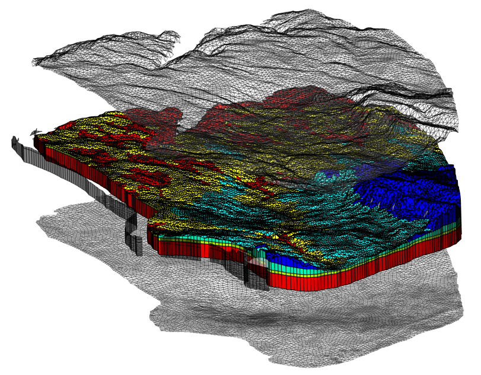
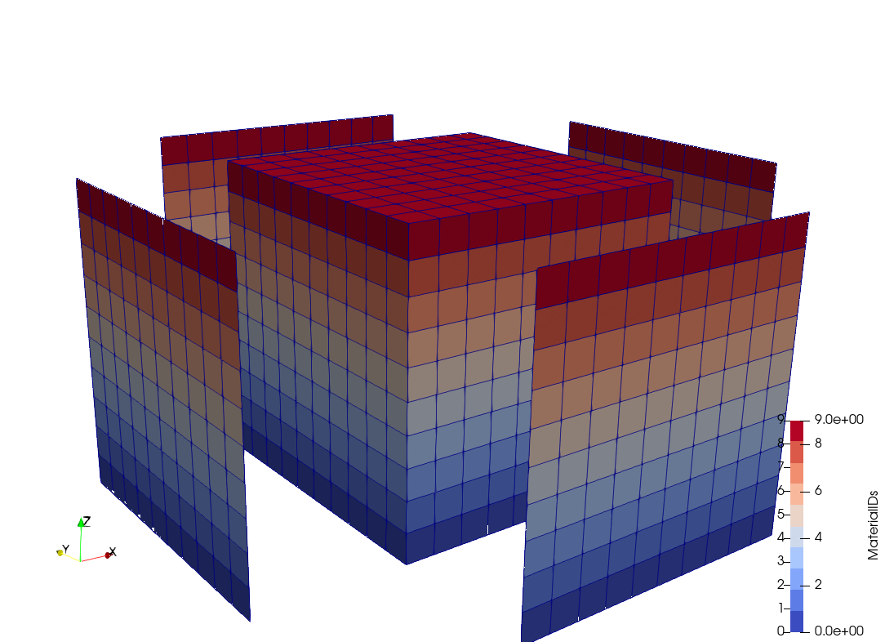

+++
date = "2018-03-07T15:56:57+01:00"
title = "Extract Surface"
author = "Thomas Fischer"
+++

## General

The tool extracts 2d surface elements of a mesh given either in the VTU or MSH format. Since the algorithm uses the element surface normals a correct node ordering of the element nodes is required. The user can specify the components of the normal the extracted surface should have.

## Usage

```bash
ExtractSurface -i [<file name of input mesh>] [-o <file name of output mesh>]
 [-x <floating point value>] [-y <floating point value>] [-z <floating point value>]
 [-a <floating point value>]
 [--ascii-output]
```

- The normal of the surface that should be extracted is given by the arguments `-x`, `-y` and `-z`. The default normal is (0,0,-1).
- The command line option `-a` can be used to specify the allowed deviation of the normal of the surface element from the given normal.
- New data arrays containing the original IDs for nodes, elements, and faces from the source mesh are added to the extracted boundary mesh.  These data arrays are required for specifying source terms or setting boundary conditions during a simulation run of OpenGeoSys.
- The switch 'ascii-output' produces VTU files containing the data in human readable ASCII format instead of binary format.

## Example



Extracted top, bottom and side surfaces:

- top `ExtractSurface -i Input.vtu -o TopSurface.vtu`
- bottom `ExtractSurface -i Input.vtu -o BottomSurface.vtu -x 0 -y 0 -z 1`
- side `ExtractSurface -i Input.vtu -o SideSurface.vtu -x 1 -y 1 -z 0 -a 45`


