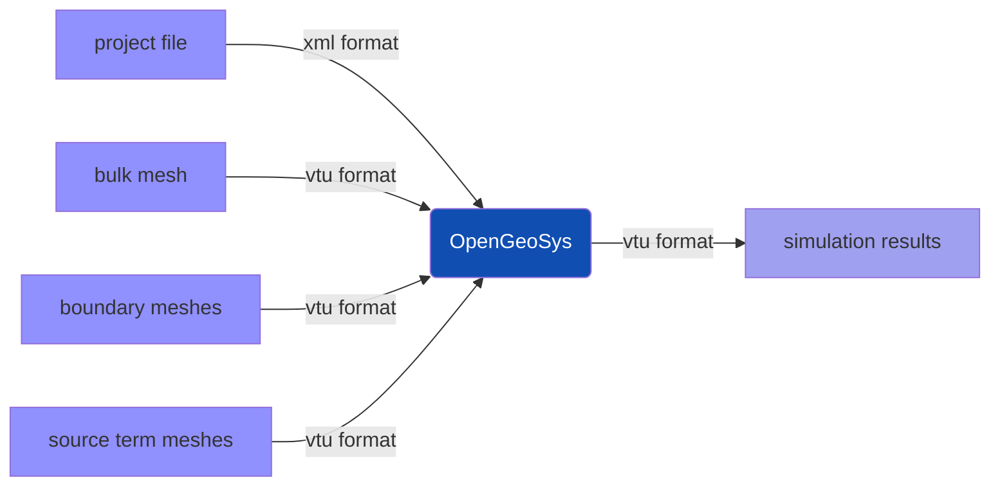
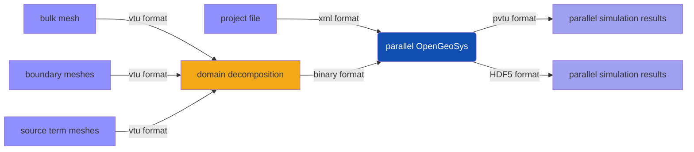
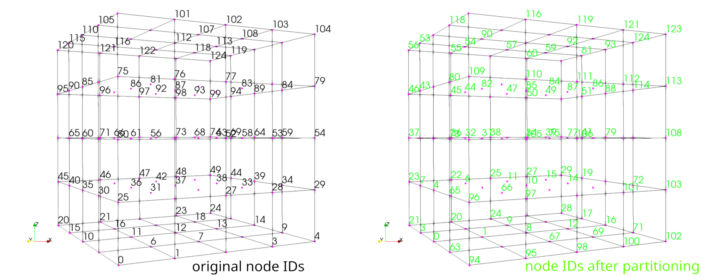
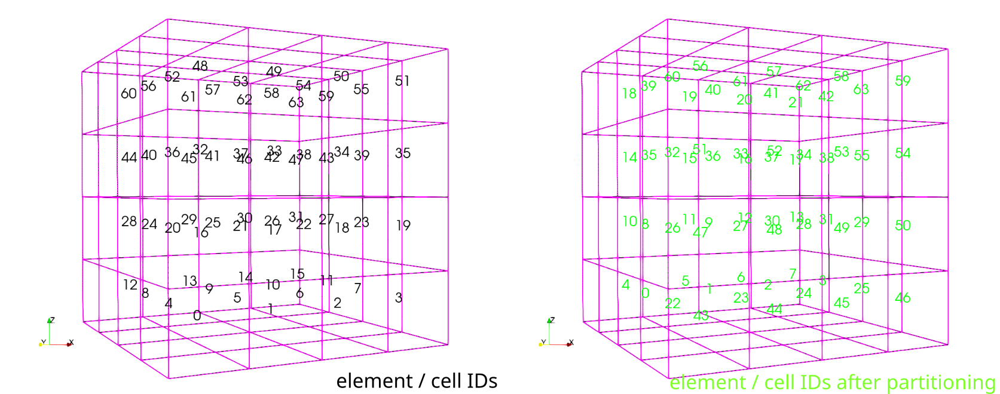

+++
title = "Reorder Mesh"
date = "2022-12-05T15:46:57+01:00"
author = "Thomas Fischer"
+++

## Building the Tool ReorderMesh

The tool is build when the `OGS_BUILD_UTILS` CMake switch is set `ON`. The build
executable `ReorderMesh` is placed in the `bin` directory. The tool is a command line tool.

Running `ReorderMesh` tool will print the required arguments and a short usage message; for detailed usage add the `--help` argument.

```bash
> ReorderMesh --help ⏎
```

To reorder a bulk mesh two arguments are required:

- file name for the input mesh including `bulk_node_ids` and `bulk_element_ids` information,
- file name for the reordered mesh.

## Why is the tool necessary?

In contrast to a serial simulation



for a parallel simulation



a domain decomposition is required as a preprocessing step. As you can see in
the following pictures the domain decomposition (into 2 sub-domains) changes the
sequence of nodes and elements. On the left the initial node and element
orderings are depicted, on the right the ordering after partitioning is shown.





Simple element-wise or node-wise comparisons of simulation results are not
possible. The tool `ReorderMesh` can be applied to reorder the nodes and
elements to the initial ordering.

Typically, the workflow is as follows:


A similar workflow is implemented using `snakemake` for testing the `ReorderMesh`
tool.
