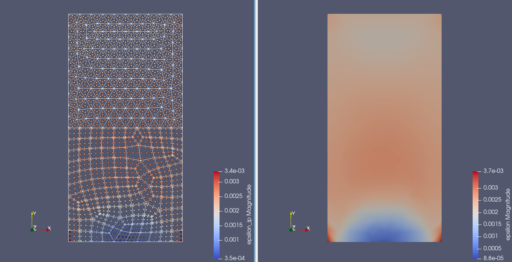

+++
title = "Integration point data investigation"
author = "Christoph Lehmann"
+++

The tool `ipDataToPointCloud` converts an input mesh with OGS's integration
point data to a point cloud whose nodes are the integration points of the input
mesh.

## Usage

`ipDataToPointCloud  -i <path> -o <path>`

## Example

Invoking the tool on a [mixed element test mesh]({})
we can create the following visualization in ParaView:

On the _right_ we see the extrapolated strain magnitude (nodal data, `epsilon`)
visualized on the input mesh.
Due to extrapolation and averaging artefacts, this data can be distorted very
much. In this example it looks OK.

The input mesh also contains the corresponding integration point data (VTU field
data, `epsilon_ip`), which are the raw data used in OGS's equation system
assembly without output related artefacts.
Unfortunately, ParaView and other tools do not have a good support for the
visualization of such field data.
In order to visualize the data and provide integration point coordinates, the
tool `ipDataToPointCloud` can be used.
Its result is visualized on the _left_ (nodes) together with a wireframe
representation of the input mesh.
