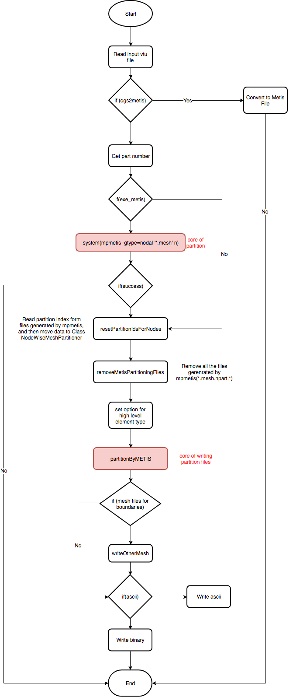

+++
title = "Partition a mesh with `partmesh`"
author = "Zhang Ning"

[menu]
  [menu.tools]
    parent = "model-preparation"
+++

`partmesh` is an OpenGeoSys parallel simulation model preparation command line
tool.  It is used to generate partitioned mesh from vtu files. In the background
`mpmetis` will be used to get a partitioned index for nodes, and then write the
partitioned data and properties in binary files suitable for parallel
simulations.

See workflow documentation on how to [create a simple parallel model]().
