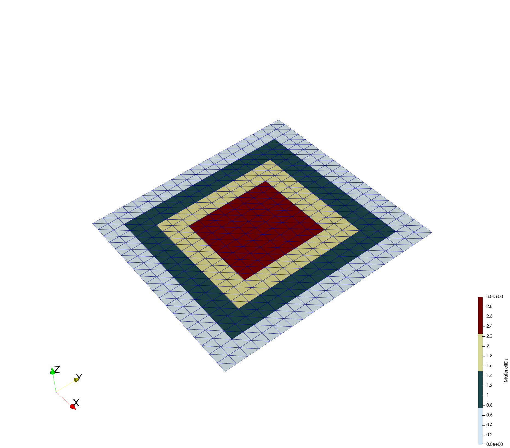
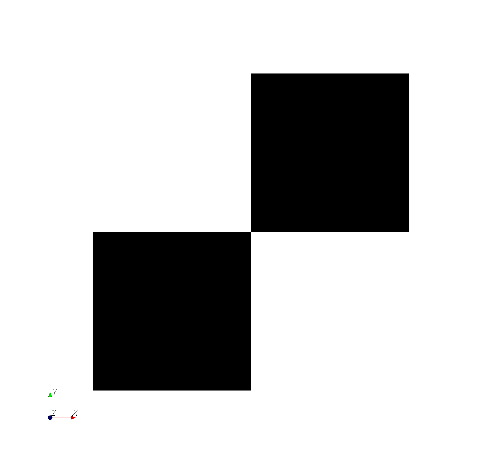
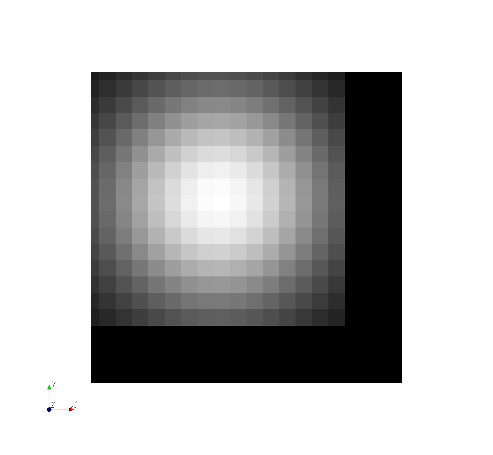
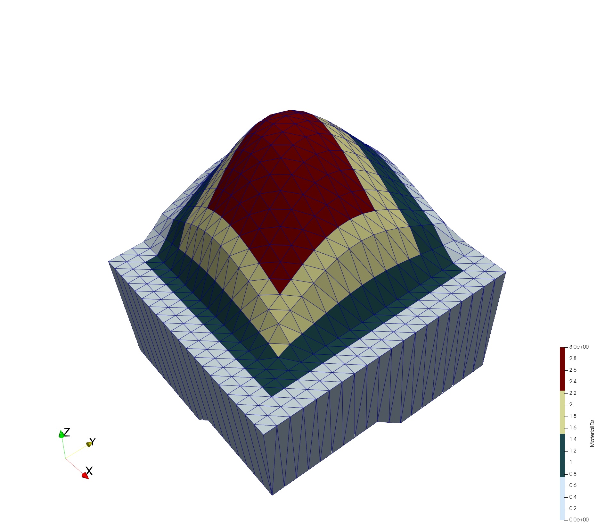

+++
date = ""
title = "createLayeredMeshFromRasters"
author = "Julian Heinze"
+++

## Description

createLayeredMeshFromRasters is a tool for creating a 3D mesh from a 2D mesh by adding layers to the 2D mesh.
The layers are created from the x-y coordinates of the mesh combined with the z-coordinates from raster files (`*.asc`, `*.grd`, `*.xyz`).
The tool builds the 3D mesh starting with the bottom layer.
The bottom layer must cover the complete domain, i.e. it needs to have as many nodes as the 2D input mesh.
If not an error will occur as there is no information on the lower boundary of the mesh.
Currently, only inputs from line and triangle elements are supported, since mapping quads can result in invalid mesh elements.
The different layers have to be listed in an extra `.txt`-file, where the top to bottom arrangement is given by the order of the raster files in the `.txt`-file.

## Usage

```bash
   createLayeredMeshFromRasters  -i <file name> -o <file name> -r <file name>
                                [-t <floating point number>] [--ascii_output]
                                [--keep-surface-material-ids]
                                [--] [--version] [-h]


Where:

   -i <file name>,  --input-mesh-file <file name>
     (required)  The file name of the 2D input mesh.

   -o <file name>,  --output-mesh-file <file name>
     (required)  The file name of the resulting 3D mesh.

   -r <file name>,  --raster-list <file name>
     (required)  An ascii-file containing a list of raster files, starting
     from top (DEM) to bottom.

   --keep-surface-material-ids
     if the argument is present the materials defined in the surface mesh
     are used to set the material information for the subsurface cells

   -t <floating point number>,  --thickness <floating point number>
     The minimum thickness of a layer to be integrated at any given
     location.

   --ascii_output
     Write VTU output in ASCII format.

   --,  --ignore_rest
     Ignores the rest of the labeled arguments following this flag.

   --version
     Displays version information and exits.

   -h,  --help
     Displays usage information and exits.
```

## Examples

### First example: different material id value per layer

<p align='center'>
 
</p>
<p align = "center">
Fig.1 2D input mesh mapped to an elevation (generated with the tool <a href ="/docs/tools/preprocessing/meshmapping"> MeshMapping</a>, although it is not necessary to use a mapped mesh, a flat mesh is sufficient). The z-values of the mesh are scaled by a factor of 10.
 </p>
Create layers below a given 2D mesh according to a list of raster files.

```bash
createLayeredMeshFromRasters -i mesh_mapped.vtu -o mesh_layered.vtu -r list_raster_mesh.txt
```

The `.txt`-file that contains the list of raster files, in this example it is called `list_raster_mesh.txt`, is specified as follows:

```bash
path/to/raster-file/DEM.asc
path/to/raster-file/m0.asc
path/to/raster-file/m1.asc
path/to/raster-file/m2.asc
path/to/raster-file/m3.asc
path/to/raster-file/m4.asc
path/to/raster-file/m5.asc
path/to/raster-file/m6.asc
```

<p align='center'>
 
</p>
<p align = "center">
Fig.2 The layered 3D output mesh created from raster files. The different colors depict different material IDs. The z-values of the mesh are scaled by a factor of 10.
 </p>

### Second example: Keep the material IDs given by the 2D input mesh

2d input mesh and the input rasters:





rasters.txt

```bash
path/to/raster-file/dem.asc
path/to/raster-file/bottom.asc
```

```bash
createLayeredMeshFromRasters -i rectangular_tris_with_materials.vtu -o raster_based_3d_mesh.vtu -t 0.1 -r rasters.txt --keep-surface-material-ids
```

The result is then a 3d mesh with a material ID distribution as it is in the 2d
mesh provided as input.


