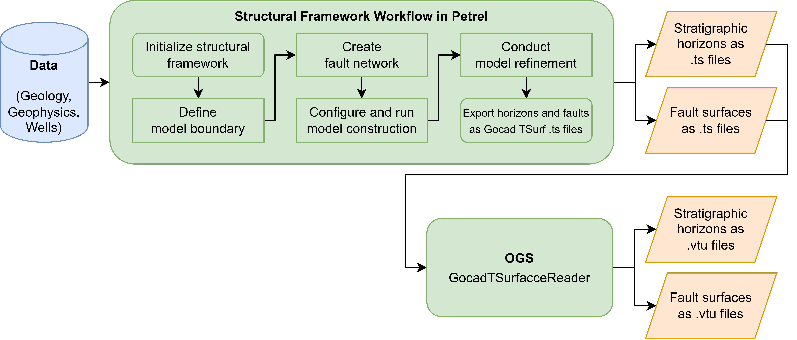
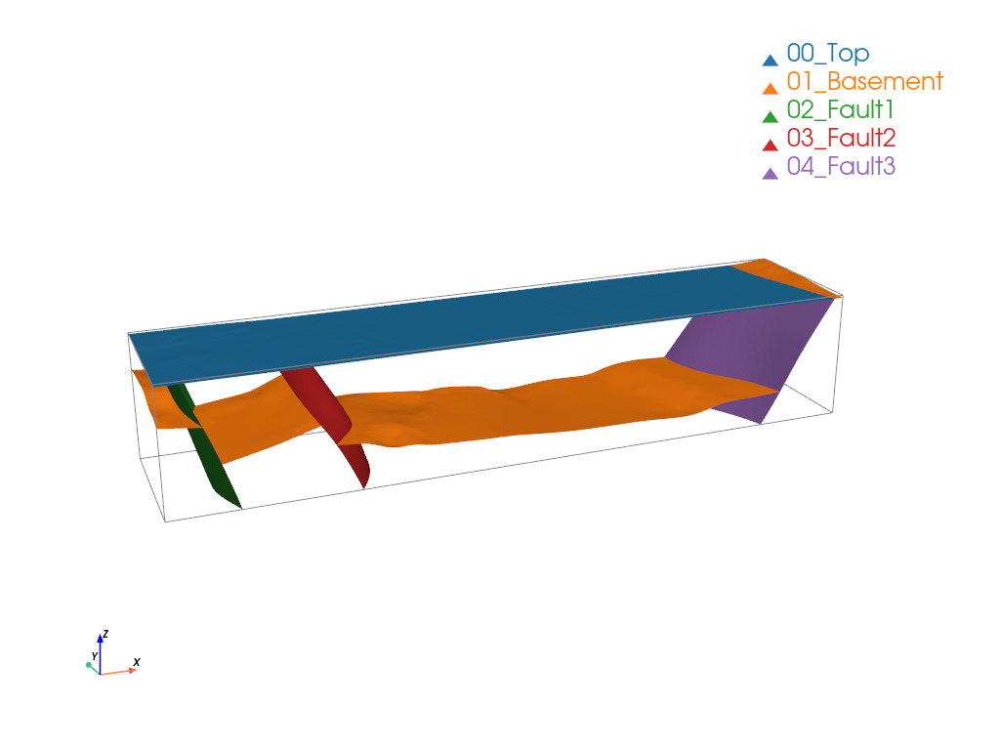
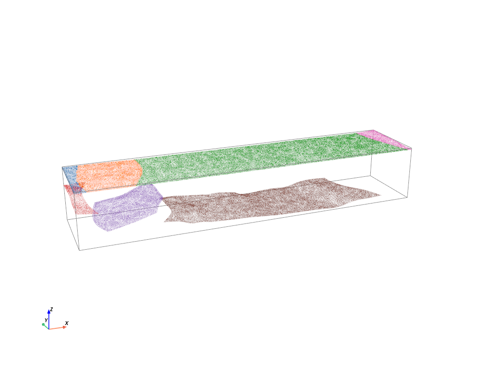
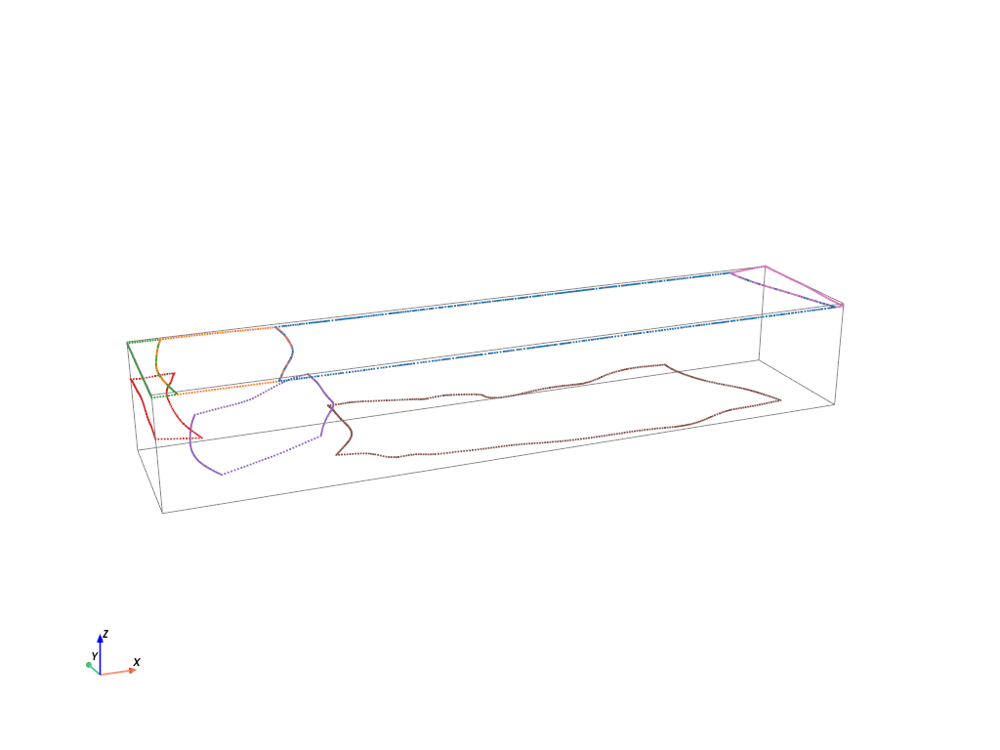
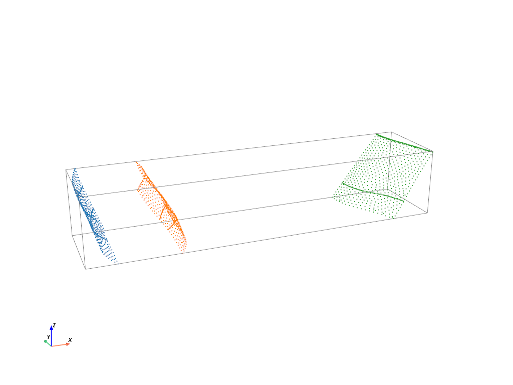
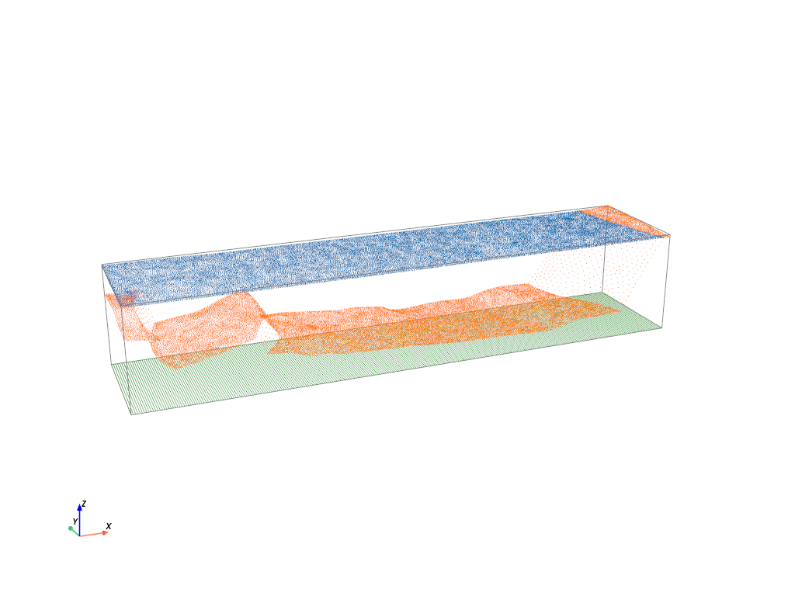
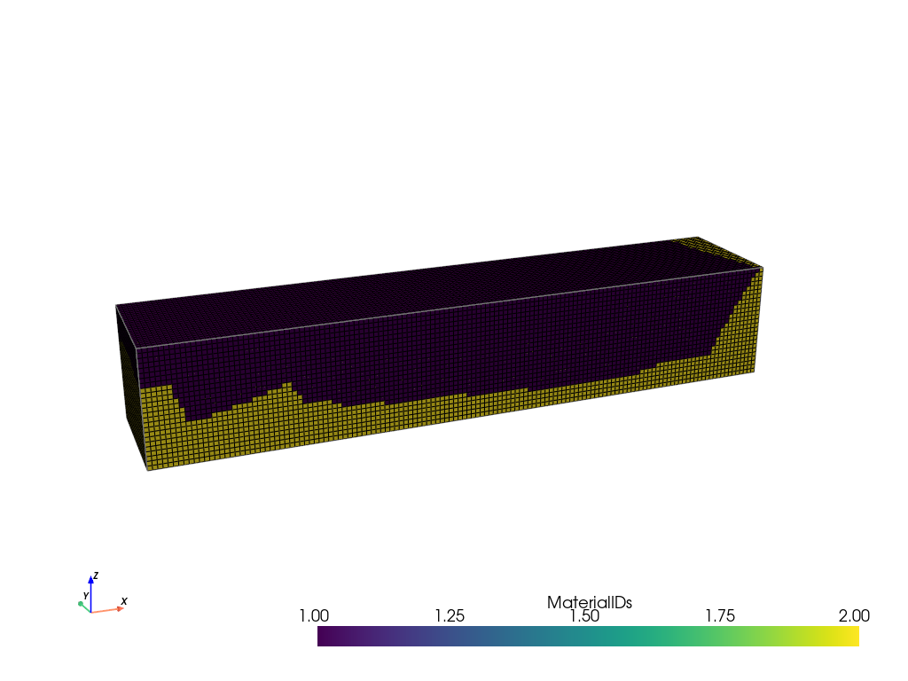

+++
date = "2025-03-18T16:00:13+01:00"
title = "Using PETREL geological models with OGS"
author = "Fransiskus Santoso"
image = "Petrel-OGS-Overview.png"
+++

<!-- vale off -->

```python
import numpy as np
import pyvista as pv
from ogs import cli
from ogstools import meshlib as ml
from ogstools.meshlib.region import to_region_voxel
```

## Model Preparation in Petrel

The underlying 3D model originates from the Master's thesis by Fransiskus Litani Santoso with the title “Thermo-Hydraulic Modeling of the Northern Upper Rhine Graben using OpenGeoSys” (simplified version).
The model is located in the Northern Upper Rhine Graben, which extends from 447000 to 475000 easting and from 5495000 to 5501000 northing (UTM zone 32N).
The 3D modeling was conducted in Petrel with the structural framework workflow.
All geological and fault surfaces should be exported from PETREL as Gocad TSurfaces .ts files.
These .ts files must be converted into .vtu files before the meshing work can begin.
This can be done using the “GocadTSurfaceReader” in OpenGeoSys, which reads the voxel set (VSET), the polylines (PLINE) and the triangulated surfaces (TSURF) from the .ts file and translates them into the $\textrm{*.vtu}$ file format.
These converted vtu files can then be used for the meshing procedure with PyVista and OGSTools “ogstools.meshlib” later. <br>



Now we convert TSurfaces ($\textrm{*.ts}$) files to VTU ($\textrm{*.vtu}$) files with GocadTSurfaceReader.

```python
path_ts = "./ts/"
path_vtu = "./vtu/"

strat_list = ["00_Top", "01_Basement"]
fault_list = ["02_Fault1", "03_Fault2", "04_Fault3"]

for strat in strat_list:
    cli.GocadTSurfaceReader(i=path_ts+strat+".ts", o=path_vtu)

for fault in fault_list:
    cli.GocadTSurfaceReader(i=path_ts+fault+".ts", o=path_vtu)

# confirm the number of entries in strat_list and fault_list are correct
assert len(strat_list) == 2, f"Expected 2 stratigraphic layers but got {len(strat_list)}"
assert len(fault_list) == 3, f"Expected 3 faults but got {len(fault_list)}"
```

## Meshing Preparation in PyVista

Before starting the meshing work with OGSTools “ogstools.meshlib”, some preparatory steps must be carried out.

### Define Model Extent

Firstly, the model extent and resolution must be defined.
Subsequently, the .vtu files must be imported in PyVista.
It is recommended to import stratigraphic and fault surfaces separately.
We first define the model extent and resolution.

```python
model_extent = [447000, 475000, 5495000, 5501000, -5000, 1000] # [x1, x2, y1, y2, z1, z2]
model_res = 200 # meter
```

Then read $\textrm{*.vtu}$ surface files and visualize all surfaces in PyVista.

```python
strat_vtu = [pv.read(i) for i in [path_vtu + i + ".vtu" for i in strat_list]]
fault_vtu = [pv.read(i) for i in [path_vtu + i + ".vtu" for i in fault_list]]

pl = pv.Plotter()
pl.renderer.set_color_cycler("default") # for coloring
for i in range(len(strat_vtu)):
    pl.add_mesh(strat_vtu[i], label=strat_list[i])
for i in range(len(fault_vtu)):
    pl.add_mesh(fault_vtu[i], label=fault_list[i])
pl.add_legend(bcolor='w')
pl.add_bounding_box()
pl.show_axes()
pl.view_vector([-1,-2.5,1])
#pl.show()
pl.show(jupyter_backend="static")
```



### Prepare Stratigraphic Surfaces

Each stratigraphic surface must be divided into different parts that are dissected by the faults.
As only 3 faults are included in the model, the work can be done manually.
However, for a larger model with many faults, a semi-automatic approach is desirable and highly recommended.
This can be solved mathematically or with the help of a machine learning method, but these are not part of this tutorial at the moment. <br>

Here we extract nodes from the stratigraphical surfaces and separate nodes into different parts (ordered from west to east).
First the top nodes

```python
nodes_top_1 = strat_vtu[0].points[24638:] # West
nodes_top_2 = strat_vtu[0].points[20244:24638] # Center
nodes_top_3 = strat_vtu[0].points[:20244] # East
nodes_top = [nodes_top_1, nodes_top_2, nodes_top_3]
```

Then the basement nodes.

```python
nodes_basement_1 = strat_vtu[1].points[21695:] # West
nodes_basement_2 = strat_vtu[1].points[16929:21695] # Center-West
nodes_basement_3 = strat_vtu[1].points[1298:16929] # Center-East
nodes_basement_4 = strat_vtu[1].points[:1298] # East
nodes_basement = [nodes_basement_1, nodes_basement_2, nodes_basement_3, nodes_basement_4]
# confirm the number of entries in nodes_basement is correct
assert len(nodes_basement) == 4, f"Expected 4 basement nodes but got {len(nodes_basement)}"
```

We can plot them in pyvista to check.

```python
pl = pv.Plotter()
pl.renderer.set_color_cycler("default") # for coloring
for i in range(len(nodes_top)):
    pl.add_points(nodes_top[i], point_size=1)
for i in range(len(nodes_basement)):
    pl.add_points(nodes_basement[i], point_size=1)
pl.add_bounding_box()
pl.show_axes()
pl.view_vector([-1,-2.5,1])
#pl.show()
pl.show(jupyter_backend="static")
```



The boundaries are then to be extracted from each stratigraphic surface part.
The work is also carried out manually and a semi-automatic calculation is recommended for bigger projects.
Here we extract boundaries from the stratigraphical surfaces and separate boundaries into different parts (ordered from west to east).

```python
boundary_strat_all = [i.extract_feature_edges(boundary_edges=True, non_manifold_edges=False, manifold_edges=False) for i in strat_vtu]

# 00_Top
boundary_top_1 = boundary_strat_all[0].points[:624] # West
boundary_top_2 = boundary_strat_all[0].points[624:830] # Center
boundary_top_3 = boundary_strat_all[0].points[828:] # East
boundary_top = [boundary_top_1, boundary_top_2, boundary_top_3]

# 01_Basement
boundary_basement_1 = boundary_strat_all[1].points[800:] # West
boundary_basement_2 = boundary_strat_all[1].points[608:800] # Center-West
boundary_basement_3 = boundary_strat_all[1].points[156:608] # Center-East
boundary_basement_4 = boundary_strat_all[1].points[:156] # East
boundary_basement = [boundary_basement_1, boundary_basement_2, boundary_basement_3, boundary_basement_4]

# Plot in pyvista for checking
pl = pv.Plotter()
pl.renderer.set_color_cycler("default") # for coloring
for i in range(len(boundary_top)):
    pl.add_points(boundary_top[i], point_size=2)
for i in range(len(boundary_basement)):
    pl.add_points(boundary_basement[i], point_size=2)
pl.add_bounding_box()
pl.show_axes()
pl.view_vector([-1,-2.5,1])
pl.show(jupyter_backend="static")
```



After the boundaries have been extracted, the boundary nodes must be sorted to form a closed counterclockwise loop to make the topology more simple.
This can be done with this function:
> sort_boundary(boundary_nodes, model_extent, show=True)
>
> - boundary_nodes: the nodes to be sorted, type: numpy array, [[boundary_south] [boundary_east] [boundary_north] [boundary_west]] <br>
> - model_extent: model extent, type: list, [x_start, x_end, y_start, y_end, z_bottom, z_top] <br>
> - show: showing the nodes in PyVista for checking, type: True or False <br>

Now let's sort the boundary to get a closed loop.

```python
def sort_boundary(boundary_nodes, model_extent, show=False):

    # South boundary
    boundary_temp = boundary_nodes[boundary_nodes[:,1] == model_extent[2]]
    sorted_indices = np.argsort(boundary_temp[:, 0])
    boundary_south = boundary_temp[sorted_indices]

    # North boundary
    boundary_temp = boundary_nodes[boundary_nodes[:,1] == model_extent[3]]
    sorted_indices = np.argsort(boundary_temp[:, 0])[::-1]
    boundary_north = boundary_temp[sorted_indices]

    # East boundary
    boundary_temp = boundary_nodes[boundary_nodes[:,0] == model_extent[1]]
    sorted_indices = np.argsort(boundary_temp[:, 1])
    boundary_east = boundary_temp[sorted_indices]
    if len(boundary_east) == 0:
        boundary_temp = np.vstack((boundary_south, boundary_north))
        boundary_temp = np.array([i for i in boundary_nodes if not any(np.array_equal(i, j) for j in boundary_temp)])
        start = boundary_south[-1] # Get the starting point (end point of the boundary_south)
        distances = np.linalg.norm(boundary_temp - start, axis=1) # Get the Euclidean distance
        nearest_index = np.argmin(distances) # Find the index of the smallest distance
        boundary_east = []
        while len(boundary_temp) > 0:
            if distances[nearest_index] < 500:
                boundary_east.append(boundary_temp[nearest_index])
                start = boundary_temp[nearest_index]
                boundary_temp = np.delete(boundary_temp, nearest_index, axis=0)
                if len(boundary_temp) >= 1:
                    distances = np.linalg.norm(boundary_temp - start, axis=1) # Get the Euclidean distance
                    nearest_index = np.argmin(distances) # Find the index of the smallest distance
            else:
                break
        boundary_east = np.array(boundary_east)
        boundary_east = np.concatenate(([boundary_south[-1]], boundary_east, [boundary_north[0]]))

    # West boundary
    boundary_temp = boundary_nodes[boundary_nodes[:,0] == model_extent[0]]
    sorted_indices = np.argsort(boundary_temp[:, 1])[::-1]
    boundary_west = boundary_temp[sorted_indices]
    if len(boundary_west) == 0:
        boundary_temp = np.vstack((boundary_south, boundary_east, boundary_north))
        boundary_temp = np.array([i for i in boundary_nodes if not any(np.array_equal(i, j) for j in boundary_temp)])
        start = boundary_north[-1] # Get the starting point (end point of the boundary_north)
        distances = np.linalg.norm(boundary_temp - start, axis=1) # Get the Euclidean distance
        nearest_index = np.argmin(distances) # Find the index of the smallest distance
        boundary_west = []
        while len(boundary_temp) > 0:
            if distances[nearest_index] < 500:
                boundary_west.append(boundary_temp[nearest_index])
                start = boundary_temp[nearest_index]
                boundary_temp = np.delete(boundary_temp, nearest_index, axis=0)
                if len(boundary_temp) >= 1:
                    distances = np.linalg.norm(boundary_temp - start, axis=1) # Get the Euclidean distance
                    nearest_index = np.argmin(distances) # Find the index of the smallest distance
            else:
                break
        boundary_west = np.array(boundary_west)
        boundary_west = np.concatenate(([boundary_north[-1]], boundary_west, [boundary_south[0]]))

    boundary_sorted = [boundary_south, boundary_east, boundary_north, boundary_west]

    if show == True:
        pl = pv.Plotter()
        pl.add_points(boundary_south, color='red', point_size=2.5)
        pl.add_points(boundary_east, color='green', point_size=2.5)
        pl.add_points(boundary_north, color='orange', point_size=2.5)
        pl.add_points(boundary_west, color='blue', point_size=2.5)
        pl.show()

    return boundary_sorted
```

Now sort the boundary to get a closed loop.

```python
# 00_Top
boundary_top_sorted = [sort_boundary(i, model_extent=model_extent, show=False) for i in boundary_top]

# 01_Basement
boundary_basement_sorted = [sort_boundary(i, model_extent=model_extent, show=False) for i in boundary_basement]
```

### Prepare Fault Surfaces

Once all nodes and boundaries of the stratigraphic surfaces have been extracted, the fault surfaces can now be processed.
The nodes of the individual faults should be extracted.
Subsequently, nodes from the boundaries of the stratigraphic surfaces that intersect the fault surface must be added as additional nodes for better connectivity between the faults and stratigraphic surfaces.

We get nodes from the fault surfaces and intersection with stratigraphical surfaces.

```python
nodes_fault_all = []
for i in range(len(fault_vtu)):
    nodes_fault = fault_vtu[i].points
    # Basic idea: concatenate node fault with the discontinuity-pair of each fault
    # Boundary IDs, 0 is south, 1 is east, 2 is north, 3 is west
    nodes_fault = np.concatenate((nodes_fault, boundary_basement_sorted[i][1], boundary_basement_sorted[i+1][3]))
    nodes_fault_all.append(nodes_fault)
```

Now plot the figure in pyvista for checking.

```python
pl = pv.Plotter()
pl.renderer.set_color_cycler("default") # for coloring
for i in range(len(nodes_fault_all)):
    pl.add_points(nodes_fault_all[i], point_size=2)
pl.add_bounding_box()
pl.show_axes()
pl.view_vector([-1,-2.5,1])
pl.show(jupyter_backend="static")
```



For layering and creating closed zones between the individual stratigraphic layers, a clipped fault surface must be created between two consecutive stratigraphic layers.
These clipped fault surfaces are then used to connect the discontinuities of the stratigraphic layer.
This can be done by using this function:
> clip_fault(nodes_fault, boundary_strat_1, boundary_strat_2)
>
> - nodes_fault: all nodes of the fault, type: numpy array <br>
> - boundary_strat_1: upper boundary of the stratigraphic layer discontinuity, type: numpy array <br>
> - boundary_strat_2: lower boundary of the stratigraphic layer discontinuity, type: numpy array <br>

Here we need to clip the fault to the surface boundaries, the operation is only for faults that intersect the model extent and top surface.

```python
def clip_fault(nodes_fault, boundary_strat_1, boundary_strat_2):
    nodes_fault_strat = nodes_fault
    i = 1
    while i < len(boundary_strat_1):
        indices_to_delete = np.where((nodes_fault_strat[:,1] >= boundary_strat_1[i-1][1])
                                     & (nodes_fault_strat[:,1] <= boundary_strat_1[i][1])
                                     & (nodes_fault_strat[:,2] > max(boundary_strat_1[i][2], boundary_strat_1[i-1][2])))
        nodes_fault_strat = np.delete(nodes_fault_strat, indices_to_delete, axis=0)
        i += 1
    i = 1
    while i < len(boundary_strat_2):
        indices_to_delete = np.where((nodes_fault_strat[:,1] <= boundary_strat_2[i-1][1])
                                     & (nodes_fault_strat[:,1] >= boundary_strat_2[i][1])
                                     & (nodes_fault_strat[:,2] < min(boundary_strat_2[i][2], boundary_strat_2[i-1][2])))
        nodes_fault_strat = np.delete(nodes_fault_strat, indices_to_delete, axis=0)
        i += 1
    return nodes_fault_strat
```

Here we close discontinuities in 01_Basement.

```python
nodes_faults_basement = []
for i in range(len(nodes_fault_all)):
    # Basic idea: clip fault between two boundary-pair of each fault to close the discontinuity later
    # Boundary IDs, 0 is south, 1 is east, 2 is north, 3 is west
    west_dis = np.mean(boundary_basement_sorted[i][1][:,2])
    east_dis = np.mean(boundary_basement_sorted[i+1][3][:,2])
    if west_dis >= east_dis:
        nodes_clipped = clip_fault(nodes_fault_all[i], boundary_basement_sorted[i][1], boundary_basement_sorted[i+1][3])
        nodes_faults_basement.append(nodes_clipped)
    else:
        nodes_clipped = clip_fault(nodes_fault_all[i], boundary_basement_sorted[i+1][3][::-1], boundary_basement_sorted[i][1][::-1])
        nodes_faults_basement.append(nodes_clipped)
```

Subsequently, all parts of each stratigraphic layer are to be combined with the clipped faults as one stratigraphical surface to ensure there are no “empty nodes” in the point clouds.
Once this step is done, the 3D mesh can be created with OGSTools.

```python
# 00_Top
# Note: The basement is outcropped in the east of the graben shoulder
nodes_top_new = np.concatenate((nodes_top[0],nodes_top[1],nodes_top[2],nodes_basement[-1]))
surface_top = pv.UnstructuredGrid(pv.PolyData(nodes_top_new).delaunay_2d())

# 01_Basement
nodes_basement_new = np.concatenate((nodes_basement[0], nodes_faults_basement[0],
                                     nodes_basement[1], nodes_faults_basement[1],
                                     nodes_basement[2], nodes_faults_basement[2],
                                     nodes_basement[3]))
surface_basement = pv.UnstructuredGrid(pv.PolyData(nodes_basement_new).delaunay_2d())
```

Afterwards, a surface must be constructed for the bottom boundary.

```python
# Bottom Boundary
nodes_bottom = []
for y in range(model_extent[2], model_extent[3]+1, int(0.5*model_res)):
    for x in range(model_extent[0], model_extent[1]+1, int(0.5*model_res)):
        nodes_bottom.append([float(x), float(y), model_extent[4]])
nodes_bottom = np.array(nodes_bottom)
surface_bottom = pv.UnstructuredGrid(pv.PolyData(nodes_bottom).delaunay_2d())
```

We plot the figures in PyVista for checking.

```python
pl = pv.Plotter()
pl.renderer.set_color_cycler("default") # for coloring
pl.add_points(nodes_top_new, point_size=1)
pl.add_points(nodes_basement_new, point_size=1)
pl.add_points(nodes_bottom, point_size=1)
pl.add_bounding_box()
pl.show_axes()
pl.view_vector([-1,-2.5,1])
#pl.show()
pl.show(jupyter_backend="static")
```



## Meshing with OGSTools

Here, the Python library OGSTools is applied to prepare and assess THMC simulations in OpenGeoSys.
In particular, we use the “ogstools.meshlib” to create meshes from PyVista surfaces and generate structured 3D hexahedral mesh in the $\textrm{*.vtu}$ file format.

The codes used below are inspired by the codes from Tobias Meisel (Helmholtz Centre for Environmental Research GmbH - UFZ).
Here we define surface layers and zones for meshing with OGSTools.

```python
surface0 = ml.Surface(surface_top, material_id=0)
surface1 = ml.Surface(surface_basement, material_id=1)
surface2 = ml.Surface(surface_bottom, material_id=2)

Reservoir = ml.Layer(top=surface0, bottom=surface1, num_subdivisions=5)
Basement = ml.Layer(top=surface1, bottom=surface2, num_subdivisions=5)

layer_set = ml.LayerSet(layers=[Reservoir, Basement])
```

Now calculate the voxel mesh (hexahedral mesh).

```python
resolution = [model_res, model_res, model_res]
vm = to_region_voxel(layer_set, resolution=resolution).mesh

# Assert the mesh has the expected number of nodes and elements
assert vm.n_points == 106080, f"Expected 106080 nodes but got {vm.n_points}"
assert vm.n_cells == 91875, f"Expected 91875 elements but got {vm.n_cells}"

```

And plot it in PyVista.

```python
pl = pv.Plotter()
pl.add_mesh(vm, scalars="MaterialIDs", show_edges=True)
pl.add_bounding_box()
pl.show_axes()
pl.view_vector([-1,-2.5,1])
#pl.show()
pl.show(jupyter_backend="static")
```


As can be seen above, the mesh quality along the boundaries of the model domain is poor.
Therefore, the mesh must be clipped to eliminate this poor mesh quality.
With the code below, the original 3D mesh is cut on each boundary by 1.5x of the model resolution, i.e. $1.5*\textrm{resolution} = 1.5*200~\textrm{m} = 250~\textrm{m}$.

```python
# Clip the 3D mesh (exclude boundary of the model extent due to poor mesh quality)
resolution = [model_res, model_res, model_res]
vm_bounds = [model_extent[0]+1.5*resolution[0],
             model_extent[1]-1.5*resolution[0],
             model_extent[2]+1.5*resolution[1],
             model_extent[3]-1.5*resolution[1],
             model_extent[4]+1.5*resolution[2],
             model_extent[5]-1.5*resolution[2]]
vm_clipped = vm.clip_box(vm_bounds, invert=False, crinkle=True, merge_points=False)

# Function to plot mesh in PyVista
def plot_mesh(mesh):
    pl = pv.Plotter()
    pl.add_mesh(mesh, scalars="MaterialIDs", show_edges=True)
    pl.add_bounding_box()
    pl.show_axes()
    pl.view_vector([-1,-2.5,1])
    pl.show(jupyter_backend="static")

# Plot the clipped mesh
plot_mesh(vm_clipped)

# Save mesh as .vtu file
vm_clipped.save("./exported/3D_hex_mesh.vtu")
```



## Incorporate Faults to the Mesh

In order for the fault zones to be assigned their own thermal-hydraulic parameters, each fault zone must be incorporated into the 3D mesh and assigned its own material ID.
The input files for the faults should be 2D meshes.
This step can be carried out in OGS using the “AddFaultToVoxelGrid” tool.

```python
# Incorporate faults to the 3D hex-mesh

i = 0
while i < len(fault_list):
    if i == 0:
        cli.AddFaultToVoxelGrid(i="./exported/3D_hex_mesh.vtu",
                                f=path_vtu+fault_list[i]+".vtu",
                                o="./exported/3D_hex_mesh_withFault"+str(i+1)+".vtu")
    if i > 0:
        cli.AddFaultToVoxelGrid(i="./exported/3D_hex_mesh_withFault"+str(i)+".vtu",
                                f=path_vtu+fault_list[i]+".vtu",
                                o="./exported/3D_hex_mesh_withFault"+str(i+1)+".vtu")
    i += 1
```

```python
# Assert the mesh has the expected number of nodes and elements
assert mesh_withFault.n_points == 106080, f"Expected 106080 nodes but got {mesh_withFault.n_points}"
assert mesh_withFault.n_cells == 91875, f"Expected 91875 elements but got {mesh_withFault.n_cells}"

# Visualize with PyVista and plot
mesh_withFault = pv.read("./exported/3D_hex_mesh_withFault"+str(i)+".vtu")
plot_mesh(mesh_withFault)
```


The exported structured 3D hexahedral mesh can now be used for simulation in OGS.
<!-- vale on -->
