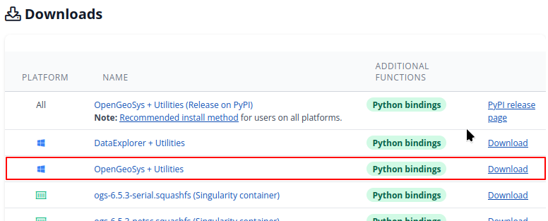
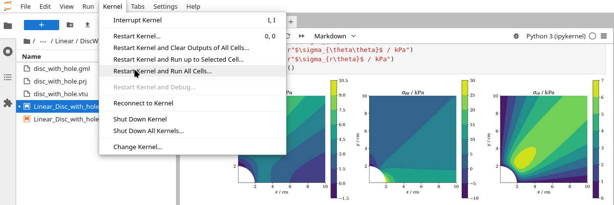

+++
date = "2024-12-13T14:30:38"
title = "Your first OGS run in 5 minutes"
author = "Christoph Lehmann"
weight = 11

aliases = [ "/docs/userguide/",
            "/docs/quickstart/",
            "/docs/quickstart/basics/quickstart" ] # Redirect for Hydrology III tutorial

[menu.docs]
name = "User Guide"
identifier = "userguide"
weight = 1
post = "Download, install and run an OGS benchmark in 5 minutes! No development setup required."
[menu.docs.params]
category = "User"
+++

Being a large software tool, mastering OGS in its entirety is a complex task.
But running your first OGS simulation actually isn't that hard if you start with
one of the many existing test cases.
From there on you can start to learn OGS and adapt the simulation model using
our user guide and [tutorials](/docs/tutorials).

As a simple example we take the [disc with a hole benchmark test case](/docs/benchmarks/small-deformations/linear_disc_with_hole) from
our benchmark gallery.
This benchmark analyzes the stress distribution emerging in a large
two-dimensional disc that is stretched in the $y$ direction.
The stress distributions (in polar coordinates) obtained in that test case are visualized in the figure
below, the instructions to run OGS follow below the
figure...

## Option 1: OGS binaries

**That only works on Windows**, because we only offer prebuilt binaries of OGS for
Windows. Users of Linux or Mac can use OGS with Python [(see below)](#python),
or some [container technology](/docs/userguide/basics/container/).

1. Download the OGS binaries from our [release page](/releases#current).
   
2. [Download](https://gitlab.opengeosys.org/ogs/ogs/-/archive/master/ogs-master.zip?path=Tests/Data/Mechanics/Linear/DiscWithHole)
   the disc with hole example zip file from our GitLab server and unzip it.  
   The zip file contains (in the subdirectory
   `Tests/Data/Mechanics/Linear/DiscWithHole`)
   the [project file](/docs/userguide/basics/project_file_intro/),
   the simulation mesh,
   and a file defining the geometries on which boundary conditions are applied.
   Its contents can be viewed online [here](https://gitlab.opengeosys.org/ogs/ogs/-/tree/master/Tests/Data/Mechanics/Linear/DiscWithHole).
3. Run OGS:  
   
4. View the written output files (`*.pvd`, `*.vtu`), e.g., with [ParaView](https://www.paraview.org/).

## Option 2: Python {#python}

If you are familiar with Python and have a working Python installation at hand,
you can have an **even simpler TODO** start:

1. Create a Python virtual environment and activate it (for more details see
   [here](/docs/userguide/basics/introduction/)).
2. Install the requirements: `pip install ogstools`.  
   This will install [OGSTools](https://ogstools.opengeosys.org), our collection
   of Python pre- and postprocessing tools, which in turn will pull in as
   dependencies [the OGS Python package](https://pypi.org/project/ogs/),
   [PyVista](https://pyvista.org/) for 3D visualization,
   [Matplotlib](https://matplotlib.org/),
   [Pandas](https://pandas.pydata.org/),
   and [NumPy](https://numpy.org/), among others.
3. [Download](https://gitlab.opengeosys.org/ogs/ogs/-/archive/master/ogs-master.zip?path=Tests/Data/Mechanics/Linear/DiscWithHole)
   the disc with hole example zip file from our GitLab server and unzip it.  
   The zip file contains (in the subdirectory
   `Tests/Data/Mechanics/Linear/DiscWithHole`)
   the [project file](/docs/userguide/basics/project_file_intro/),
   the simulation mesh,
   and a file defining the geometries on which boundary conditions are applied.
   Its contents can be viewed online [here](https://gitlab.opengeosys.org/ogs/ogs/-/tree/master/Tests/Data/Mechanics/Linear/DiscWithHole).
4. [Download](/docs/benchmarks/small-deformations/linear_disc_with_hole/Linear_Disc_with_hole.ipynb)
   the Jupyter notebook underlying the
   [benchmark gallery page](/docs/benchmarks/small-deformations/linear_disc_with_hole)
   of the test case.  
   Put the notebook in the same directory as the unzipped project file and mesh
   from step 3. This directory should contain the following files, now:
   * `disc_with_hole.gml`
   * `disc_with_hole.prj`
   * `disc_with_hole.vtu`
   * `Linear_Disc_with_hole.ipynb`
   * `Linear_Disc_with_hole.py`
5. Install [JupyterLab](https://jupyter.org/) to run the notebook later on: `pip install jupyterlab`.  
   Remember: the Python virtual environment from step 1 must still be
   activated.
6. Open the notebook from step 4 in JupyterLab.  
   The notebook already contains plots of the analytical solution to the
   problem and of OGS simulation results.
   You can play around with it, now.
   A good first step is to rerun the entire notebook (*Restart Kernel and Run
   All Cells...*, see figure below).
   This will run OGS – your first OGS run!

